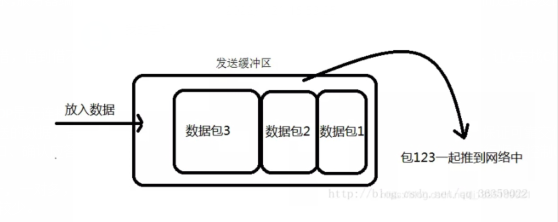
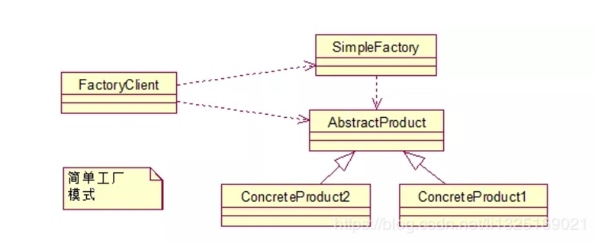
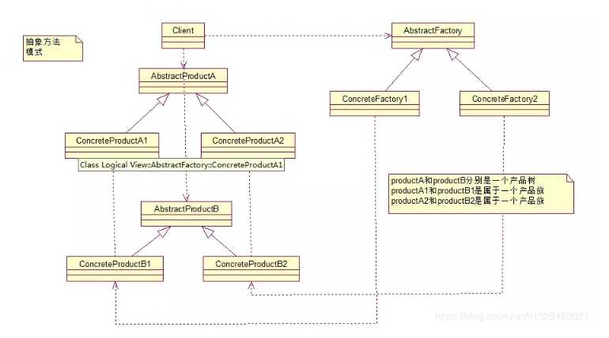
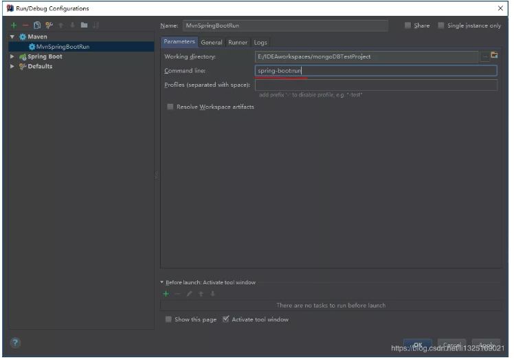
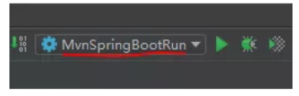

# java

## 一、java基础

### 1. JDK和JRE有什么区别
- JDK: Java Development Kit的简称，java 开发工包，提供了java的开发环境和运行环境。
- JRE: Java Runtime Environment的简称, java 运行环境，为java的运行提供了所需环境。
- 具体来说JDK实包含了JRE,同时还包含了编译java源码的编译器javac,还包含了很多java程序调试和分析的工具。简单来说:如果你需要运行java程序，只需安装JRE就可以了，如果你需要编写java程序,需要安装JDK。

### 2. ==和equals的区别是什么?
> ==解读

对于基本类型和引|用类型==的作用效果是不同的,如
下所示:
- 基本类型:比较的是值是否相同;
- 引用类型:比较的是引|用是否相同;

代码示例:
```java
String x = "string";
String y = "string";
string z = new String("string") ;
System.out.printIn(x==y); // true
System. out.println(x==z) ; // false
System. out.println(x.equa1s(y)); // true
System.out.println(x.equals(z)); // true
```

代码解读：因为x和y指向的是同一个引用，所以也是true,而new String()方法则重写开辟了内
存空间，所以==结果为false,而equals比较的一直是值，所以结果都为true。

> equals 解读

equals 本质上就是==,只不过String和Integer等重写了equals方法，把它变成了值比较。看下面的代码就明白了。

首先来看默认情况下equals 比较-一个有相同值的对象，代码如下:
```java
class Cat
    public Cat(String name) {
        this.name = name ;
    }

    private Str ing name;

    public String getName() {
        return name ;
    }
    public void setName(String name){
        this.name = name ;
    }
}
Cat C1 = new Cat("王磊");
Cat c2 = new Cat("王磊");
Sys tem . out. pr intln(C1. equals(c2)); //false
``` 

输出结果出乎我们的意料，竟然是false?这是怎么回事，看了equals源码就知道了，源码如下:
```java
public boolean equals(Object obj) { 
    return (this == obj);
}
``` 
原来equals本质上就是==。

那问题来了，两个相同值的String对象，为什么返回的是true?代码如下:
```java
String s1 = new String("老王" )
String s2 = new String("老王" )
System.out.println(s1. equals(s2)); //true
```
同样的，当我们进入String的equals方法，找到了答案，代码如下:
```java
public boolean equals(Object anObject) { 
    if (this == an0bject) {
        return true ;
    }
    if (an0bject instanceof String) {
        String anotherString = (String)an0bject;
        int n = value.length ;
        if (n == anotherString.value.length){
            char v1[] = value;
            char v2[] = anotherString;
            int i = 0;
            while(n-- != 0){
                if(v[i] != v2[i])
                    return false;
                i++;
        }
        return true ;
    }
    return false;
}
```
原来是String重写了Object 的equals方法,把引用比较改成了值比较。

> #### <font color=red>总结:</font> 
==对于基本类型来说是值比较,对于引用类型来说是比较的是引用;而equals默认情况下是引用比较，只是很多类重新了equals方法，比如String、 Integer 等把它变成了值比较,所以一般情况下equals比较的是值是否相等。
### 3. 两个对象的hashCode()相同，则equals()也一定为 true,对吗?

不对，两个对象的hashCode()相同，equals()不一定true。

代码示例:
```java
String str1 = "通话";
String str1 = "重地";
System.out.println(String.format("str1：%d | str2：%d", str1.hashCode(),str2.hashCode()));
System. out. pr intln(str1.equals(str2));
```
执行的结果:
```java
1. str1: 1179395| str2: 1179395
2. false
```
代码解读:很显然“通话”和“重地”的hashCode()相同，然而equals()则为false, 因为在散列表中,hashCode()相等即两个键值对的哈希值相等，然而哈希值相等，并不一定能得出键值对相等。

### 4. final在java中有什么作用?
- final 修饰的类叫最终类，该类不能被继承。
- final 修饰的方法不能被重写。
- final 修饰的变量叫常量,常量必须初始化，初始化之后值就不能被修改。

### 5. java中的Math.round(-1.5)等于多少?
等于-1，因为在数轴上取值时，中间值(0.5) 向右取整,所以正0.5是往上取整,负0.5是直接舍弃。

### 6.String属于基础的数据类型吗?
String 不属于基础类型，基础类型有8种: byte、boolean、char、 short、 int、 float、 long、double,而String属于对象。

### 7. java中操作字符串都有哪些类?它们之间有什么区别?
操作字符串的类有: String、 StringBuffer、StringBuilder。

String 和StringBuffer、StringBuilder 的**区别**在于String 声明的是不可变的对象，每次操作都会生成新的String对象，然后将指针指向新的String对象,而StringBuffere、StringBuilder可以在原有对象的基
础上进行操作,所以在经常改变字符串内容的情况下最好不要使用String。

StringBuffer是线程安全的，而StringBuilder是非线程安全的，但StringBuilder的性能却高于StringBuffer, 所以在单线程环境下推荐使用StringBuilder, 多线程环境下推荐使用StringBuffer。

### 8. String str="i"与String str=new String("i")一样吗？
不一样，因为内存的分配方式不-一样。String str="i”的方式，java 虚拟机会将其分配到常量池中;而String str=new String(“i")则会被分到堆内存中。

### 9.如何将字符串反转?
使用StringBuilder或者stringBuffer 的reverse()方法。

示例代码:
```java
// StringBuffer reverse
StringBuffer stringBuffer = new StringBuffer();
stringBuffer.append("abcdefg");
System.out.println(stringBuffer.reverse());//gfedcba
// StringBuilder reverse
StringBuilder stringBuilder = new StringBuilder();
stringBuilder.append("abcdefg");
System.out.println(stringBuilder.reverse());//gfedcba
```

### 10. String类的常用方法都有那些?
1. indexOf(): 返回指定字符的索引
1. charAt(): 返回指定索引处的字符。
1. replace(): 字符串替换。
1. trim(): 去除字符串两端空白。
1. split(): 分割字符串,返回一个分割后的字符串数组。
1. getBytes(): 返回字符串的byte类型数组。
1. length): 返回字符串长度。
1. toLowerCase():将字符串转成小写字母。
1. toUpperCase():将字符串转成大写字符。
1. substring):截取字符串。
1. equals(: 字符串比较。

### 11.抽象类必须要有抽象方法吗?
不需要，抽象类不一定非要有抽象方法。

示例代码:
```java
abstract class Cat {
    public static void sayHi() {
        System.out.print1n("hi~");
    }
}
```
上面代码,抽象类并没有抽象方法但完全可以正常运行。

### 12.普通类和抽象类有哪些区别?
- 普通类不能包含抽象方法,抽象类可以包含抽象方法。
- 抽象类不能直接实例化，普通类可以直接实例化。

### 13.抽象类能使用final修饰吗?
不能，定义抽象类就是让其他类继承的，如果定义为final 该类就不能被继承，这样彼此就会产生矛盾，所以final不能修饰抽象类,编辑器也会提示错误信息:

### 14.接口和抽象类有什么区别?
1. 实现:抽象类的子类使用extends来继承;接口必须使用implements来实现接口。
1. 构造函数:抽象类可以有构造函数;接口不能有构造函数。
1. main方法:抽象类可以有main方法,并且我们能运行它;接口不能有main方法。
1. 实现数量:类可以实现很多个接口;但是只能继承一个抽象类。
1. 访问修饰符:接口中的方法默认使用public修饰;抽象类中的方法可以是任意访问修饰符。

### 15. java中IO流分为几种?
1. 按功能来分:输入流(input)、 输出流(output)
1. 按类型来分:字节流和字符流。

字节流和字符流的区别是:字节流按8位传输以字节为单位输入输出数据，字符流按16位传输以字符为单位输入输出数据。
### 16. BIO、NIO、 AIO 有什么区别?
1. BIO: Block IO同步阻塞式 IO,就是我们平常使用的传统IO,它的特点是模式简单使用方便，并发处理能力低。
1. NIO: New 10同步非阻塞IO，是传统IO的升级,客户端和服务器端通过Channel (通道)通讯，实现了多路复用。
1. AIO: Asynchronous IO是NIO的升级,也叫NIO2，实现了异步非堵塞IO，异步IO的操作基于事件和回调机制。

### 17. Files的常用方法都有哪些?
1. Files. exists():检测文件路径是否存在。
1. Files.createFile(): 创建文件。
1. Files.createDirectory): 创建文件夹。
1. Files.delete(): 删除一 个文件或目录。
1. Files.copy): 复制文件。
1. Files.move(): 移动文件。
1. Files.size(): 查看文件个数。
1. Files.read): 读取文件。
1. Files.write(): 写入文件。

## 二、容器

### 18. java容器都有哪些?
常用容器的图录:


### 19. Collection和Collections有什么区别?
1. java.util.Collection 是一个集合接口 (集合类的一个顶级接口)。它提供了对集合对象进行基本操作的通用接口方法。Collection接口在Java 类库中有很多具体的实现。Collection接口的意义是为各种具体的集合提供了最大化的统一操作方式，其直接继承接口有List与Set。
2. Collections则是集合类的一个工具类/帮助类,其中提供了一系列静态方法，用于对集合中元素进行排序、搜索以及线程安全等各种操作。

### 20. List、Set、 Map之间的区别是什么? 
| 比较         | List       | Set          | Map         |
| -----------  | ----------- | ----------- | ----------- |
| 继承接口      | Collection       |    Collection   |       |
| 常见实现类    | AbstractList（其常用子类有ArrayList、LinkedList、Vetor）        |   AbstractSet（其常用子类有AHashSet、LinkedHashSet、TreeSet）    |       |
| 常见方法      | add()、remove()、clear()、get()、contains()、size()       |    add()、remove()、clear()、contains()、size()    |   put()、get()、remove()、clear()、containsKey()、containsValue()  、keySet()、values()、size()    |
| 元素         | 可重复       |    不可重复(用equals()判断)   |   不可重复    |
| 顺序          | 有序       |    无序(实际上由HashCode决定)   |       |
| 线程安全      | Vetor线程安全       |       |   Hashtable线程安全    |

### 21. HashMap和Hashtable有什么区别?
1. hashMap去掉了HashTable的contains方法,但是加上了containsValue () 和containsKey ()方法。
1. hashTable同步的， 而HashMap是非同步的, 效率上比hashTable要高。
1. hashMap允许空键值，而hashTable不允许。

### 22.如何决定使用HashMap还是TreeMap?
对于在Map中插入、删除和定位元素这类操作,HashMap是最好的选择。然而，假如你需要对一个有序的key集合进行遍历，TreeMap是 更好的选择。基于你的collection的大小，也许向HashMap中添加元素会更快，将map换为TreeMap进行有序key的遍历。
### 23.说一下HashMap的实现原理?
HashMap概述: HashMap是 基于哈希表的Map接口的非同步实现。此实现提供所有可选的映射操作，并允许使用nul值和nul键。此类不保证映射的顺序,特别是它不保证该顺序恒久不变。

HashMap的数据结构:在java编程语言中， 最基本的结构就是两种，一个是数组, 另外-一个是模拟指针(引用)，所有的数据结构都可以用这两个基本结构来构造的，HashMap也不例外。HashMap实际 上是一个“链表散列”的数结构，即数组和链表的结合当我们往Hashmap中put元素时，首先根据key的hashcode重新计算hash值,根绝hash值得到这个元素在数组中的位置(下标)，如果该数组在该位置上已经存放了其他元素那么在这个位置上的元素将以链表的形式存放,新加入的放在链头,最先加入的放入链尾，如果数组中该位置没有元素,就直接将该元素放到数组的该位置上。

需要注意Jdk 1.8中对HashMap的实现做了优化，当链表中的节点数据超过八个之后，该链表会转为红黑树来提高查询效率，从原来的O(n)到0(logn)

### 24.说一下HashSet的实现原理?
1. HashSet底层由HashMap实现
1. HashSet的值存放于HashMap的key上
1. HashMap的value统一为PRESENT

### 25. ArrayList和LinkedList的区别是什么?
最明显的区别是ArrayList底层的数据结构是数组,支持随机访问，而LinkedList 的底层数据结构是双向循环链表，不支持随机访问。使用下标访问一个元素，ArrayList 的时间复杂度是O(1)，而LinkedList是O(n)。

### 26.如何实现数组和List 之间的转换?
1. List转换成为数组:调用ArrayList的toArray方法。
1. 数组转换成为List: 调用Arrays的asList方法。

### 27. ArrayList和Vector的区别是什么?
1. Vector是同步的，而ArrayList不是。 然而，如果你寻求在迭代的时候对列表进行改变,你应该使用CopyOnWriteArrayList。
1. ArrayList比Vector快， 它因为有同步，不会过载
1. ArrayList更加通用，因为我们可以使用Collections工具类轻易地获取同步列表和只读列表。

### 28. Array和ArrayList有何区别?
1. Array可以容纳基本类型和对象，而ArrayList只能容纳对象。
1. Array是指定大小的，而ArrayList大小是固定的。
1. Array没有提供ArrayList那么多功能，比如addAll、removeAll和iterator等 。

### 29.在Queue中pol()和remove()有什么区
poll() 和remove()都是从队列中取出一个元素，但是poll()在获取元素失败的时候会返回空,但是remove()失败的时候会抛出异常。

### 30.哪些集合类是线程安全的?
1. vector: 就比arraylist多了个同步化机制(线程安全)，因为效率较低,现在已经不太建议使用。在web应用中，特别是前台页面，往往效率(页面响应速度)是优先考虑的。
1. statck: 堆栈类,先进后出。
1. hashtable: 就比hashmap多了个线程安全。
1. enumeration:枚举，相当于迭代器。

### 31.迭代器Iterator是什么?
迭代器是一种设计模式，它是一个对象， 它可以遍历并选择序列中的对象，而开发人员不需要了解该序列的底层结构。迭代器通常被称为“轻量级”对象,因创建它的代价小。

### 32. Iterator 怎么使用?有什么特点?
Java中的Iterator功能比较简单,并且只能单向移动。

1. 使用方法iterator()要求容器返回一-个Iterator。第一次调用Iterator的next()方法时，它返回序列的第一个元素。 注意: iterator()方法是java.lang.lterable接口，被Collection继承。
1. 使用next()获得序列中的下一个元素。
1. 使用hasNext)检查序列中是否还有元素。
1. 使用remove()将迭代器新返回的元素删除。

Iterator是Java迭代器最简单的实现，为List设计的Listlterator具有更多的功能，它可以从两个方向遍历List,也可以从List中插入和删除元素。

### 33. lterator 和Listlterator 有什么区别?
1. Iterator可用来遍历Set和List集合, 但是Listlterator只能用来遍历List。
1. Iterator对集合只能是前向遍历，Listlterator既可以前向也可以后向。
1. Listlterator实现了lterator接口， 并包含其他的功能，比如:增加元素，替换元素，获取前一个和后一个元素的索引，等等。


## 三、多线程


## 四、反射
### 57. 什么是反射?
反射主要是指程序可以访问、检测和修改它本身状态或行为的一种能力。

Java反射:在Java运行时环境中，对于任意一个类,能否知道这个类有哪些属性和方法?对于任意一个对象，能否调用它的任意一个方法。

Java反射机制主要提供了以下功能:
1. 在运行时判断任意一个对象所属的类。
1. 在运行时构造任意一个类的对象 。
1. 在运行时判断任意一个类所具有的成员变量和方法。
1. 在运行时调用任意一个对象的方法。

### 58. 什么是java序列化?什么情况下需要序列化?
&ensp;&ensp;&ensp;&ensp;简单说就是为了保存在内存中的各种对象的状态(也就是实例变量，不是方法)，并且可以把保存的对象状态再读出来。虽然你可以用你自己的各种各样的方法来保存object states,但是Java给你提供一种应该比你自己好的保存对象状态的机制，那就是序列化。

> 什么情况下需要序列化:
1. 当你想把的内存中的对象状态保存到一个文件中或者数据库中时候;
1. 当你想用套接字在网络.上传送对象的时候;
1. 当你想通过RMI传输对象的时候;

### 59.动态代理是什么?有哪些应用?
动态代理:当想要给实现了某个接口的类中的方法,加一些额外的处理。比如说加日志，加事务等。可以给这个类创建一个代理， 故名思议就是创建一个新的类，这个类不仅包含原来类方法的功能，而且还在原来的基础上添加了额外处理的新类。这个代理类并不是定义好的，是动态生成的。具有解耦意义，灵活，扩展性强。

> 动态代理的应用:
1. Spring的AOP
1. 加事务
1. 加权限
1. 加日志

### 60.怎么实现动态代理?
&ensp;&ensp;&ensp;&ensp;首先必须定义一个接口，还要有- -个InvocationHandler(将实现接口的类的对象传递给它)处理类。再有一个工具类Proxy(习惯性将其称为代理类，因为调用他的newInstance()可以产生代理对象,其实他只是一个产生代理对象的工具类)。利用到InvocationHandler,拼接代理类源码，将其编译生成代理类的二进制码，利用加载器加载，并将其实例化产生代理对象，最后返回。


## 五、对象拷贝
### 61.为什么要使用克隆?
&ensp;&ensp;&ensp;&ensp;想对一个对象进行处理，又想保留原有的数据进行接下来的操作，就需要克隆了，Java语言中克隆针对的是类的实例。

### 62.如何实现对象克隆?
> 有两种方式:
1. 实现Cloneable接口并重写Object类中的clone()方法;
1. 实现Serializable接口 ，通过对象的序列化和反序列化实现克隆，可以实现真正的深度克隆，代码如下:
```java
import java.io.ByteArrayInputStream;
import java.i0.ByteArray0utputStream;
import java.io.bjectInputStream;
import java.io.ObjectOutputStream;
import java.io.Ser ializable;
public class MyUtil {

    private MyUtil() {

        throw new AssertionError();
    }

    @SuppressWarnings ( "unchecked" )
        public static <T extends Serializa T clone(T obj) throws Exception{
        
        ByteArray0utputStream bout = new ByteArray0utputStream();

        Object0utputStream oos = new Object0utputStream(bout);

        oos.writeObject(obj);

        ByteArrayInputStream bin = new ByteArrayInputStream(bout.toByteArray());

        ObjectInputStream ois = new ObjectInputStream(bin);

        return (T) ois.read0bject();

        //1说明:调用ByteArrayInputStream或ByteArray0utputStream

        //这两个基于内存的流只要垃圾回收器清理对象就能够释放资源，这一点不同于对外部资源（如文件流）
    }
```
下面是测试代码:

```java
import java. io. Serializable;
/**
* 人类
* @author nnngu
*/
class Person implements Serializable{

    private static final long serialVersionUID = -9102017020286042305L;

    private String name;//姓名
    private int age;//年龄
    private Car car;//座驾

    public Person(String name，int age,Car car){
        this.name = name ;
        this.age = age
        this.car = car ;
    }


    public String getName() {
        return name ;
    }


    public void setName(String name) {
        this. name = name ;
    }


    public int getAge() {
        return age
    }

    public void setAge(int age) {
        this.age = age
    }


    public Car getCar() {
        return car;
    }

    public void setCar(Car car) {
        this.car = car
    }
    @Override
    public String toString() {
        return "Person [name=" + name + ", age=" + age + ",car=" + car + "]";
    }

}
```
```java
 
/**
* 小汽车类
* @author nnngu
*/
class Car implements Serializable{
private static final long serialVersionUID = -5732017020286042305L;

private String brand ;//品牌
private int maxSpeed//最高
public Car(String brand, int maxSpeed){
    this.brand = brand;
    this.maxSpeed = maxSpeed;
}


public String getBrand() {
    return brand;
}

public void setBrand(String brand)
    this.brand = brand;
}


public int getMaxSpeed() {
    return maxSpeed;
}


public void setMaxSpeed(int maxSpeed){
    this.maxSpeed = maxSpeed;
}

@Override
public String toString() {

    return "Car [brand=" + brand + ",maxSpeed=" + maxSpeed + "]";

}
```
```java
class CloneTest {
    public static void main(String[] args){
        try{
            Person p1 = new Person("郭靖",33,new Car("Benz",300));
            Person p2 = MyUtil.clone(p1);//深度克隆
            p2. getCar().setBrand("BYD");
            //修改克隆的Per son对象p2关联
            //原来的Person对象p1关联的汽
            //因为在克隆Person对象时其关1
            System.out.println(p1);
        }catch (Exception e){
            e.printStackTrace();
        }

    }
}
```
> 注意:基于序列化和反序列化实现的克隆不仅仅是深度克隆，更重要的是通过泛型限定，可以检查出要克隆的对象是否支持序列化，这项检查是编译器完成的，不是在运行时抛出异常，这种是方案明显优于使用Object类clone方法克隆对象。让问题在编译的时候暴露出来总是好过把问题留到运行时。

### 63.深拷贝和浅拷贝区别是什么? 
1. 浅拷贝只是复制了对象的引用地址,两个对象指向同一个内存地址，所以修改其中任意的值，另一个值都会随之变化，这就是浅拷贝(例:assign());
1. 深拷贝是将对象及值复制过来，两个对象修改其中任意的值另一个值不会改变,这就是深拷贝(例: JSON.parse()和JSON.stringify(), 但是此方法无法复制函数类型)


## 六、java Web
### 64. jsp和servlet有什么区别?
1. jsp经编译后就变成了Servlet. (JSP的本质就是Servlet, JVM只能识别java的类，不能识别JSP的代码, Web容器将JSP的代码编译成JVM能够识别的java类)
1. jsp更擅长表现于页面显示，servlet更擅长于逻辑控制
1. servlet中没有内置对象，Jsp中的内置对象都是必须通过HttpServletRequest对象,HttpServletResponse对象以及HttpServlet对象得到。
1. Jsp是Servlet的一种简化，使用Jsp只需要完成程序员需要输出到客户端的内容，Jsp中的Java脚本如何镶嵌到一个类中，由Jsp容器完成。而Servlet则是个完整的Java类，这个类的Service方法用于生成对客户端的响应。

### 65. jsp有哪些内置对象?作用分别是什么?
JSP有9个内置对象:
1. request: 封装客户端的请求,其中包含来自GET或POST请求的参数;
1. response: 封装服务器对客户端的响应;
1. pageContext: 通过该对象可以获取其他对象;
1. session: 封装用户会话的对象;
1. pplication: 封装服务器运行环境的对象;
1. out:输出服务器响应的输出流对象;
1. config: Web应用的配置对象
1. page: JSP页面本身(相当于Java程序中的this)
1. exception:封装页面拋出异常的对象。

### 66.说一下jsp的4种作用域?
JSP中的四种作用域包括page、 request、 session和application， 具体来说:
1. page代表与一个页面相关的对象和属性。
1. request代表与Web客户机发出的一个请求相关的对象和属性。一个请求可能跨越多个页面，涉及多个Web组件;需要在页面显示的临时数据可以置于此作用域。
1. session代表 与某个用户与服务器建立的- -次会话相关的对象和属性。跟某个用户相关的数据应该放在用户自己的session中。
1. application代表与整个Web应用程序相关的对象和属性，它实质上是跨越整个Web应用程序,包括多个页面、请求和会话的一个全局作用域。

### 67. session和cookie有什么区别?
1. 由于HTTP协议是无状态的协议，所以服务端需要记录用户的状态时，就需要用某种机制来识具体的用户，这个机制就是Session典型的场景比如购物车，当你点击下单按钮时，由于HTTP协议无状态，所以并不知道是哪个用户操作的，所以服务端要为特定的用户创建了特定的Session,用用于标识这个用户，并且跟踪用户，这样才知道购物车里面有几本书。这个Session是保存在服务端的，有一-个唯一 标识。在服务端保存Session的方法很多，内存、数据库、文件都有。集群的时候也要考虑Session的转移,在大型的网站，一-般会有专门的Session服务器集群，用来保存用户会话，这个时候Session 信息都是放在内存的，使用一些缓存服务比如Memcached之类的来放Session。
1. 思考一下服务端如何识别特定的客户?这个时候Cookie就登场了。每次HTTP请求的时候，客户端都会发送相应的Cookie信息到服务端。实际上大多数的应用都是用Cookie来实现Session跟踪的，第一次创建 Session的时候服务端会在HTTP协议中告诉客户端，需要在Cookie里话ID发送到服务器，我就知道你是谁了。 有人问，如果客户端的浏览器禁用了Cookie怎么办? -般这种情况下，会使用一种叫做URL重写的技术来进行会话跟踪，即每次HTTP交互,URL后面都会被附加上一个诸如sd-xxx这样的参数，服务端据此来识别用户。下，设想你某次登陆过一个网站， 下次登录的时候不想再次输入账号了，怎么办?这个信息可以写到Cookie里面，访问网站的时候，网站页面的脚本可以读取这个信息,就自动帮你把用户名给填了，能够方便一下用户。 这也是Cookie名称的由来，给用户的一点甜头。所以，总结一用来跟踪用户的状态,这个数据可以保存在集群、数据库、文件中; Cookie是客户端保存用户信息的一-种机制，用来记录用户的一些信息,也是实现Session的一种方式。

### 68.说一下session的工作原理?
其实session是一个存在服务器上的类似于一个散列表格的文件。里面存有我们需要的信息，在我们需要用的时候可以从里面取出来。类似于- -个大 号的map吧，里面的键存储的是用户的essionid, 用户向服务器发送请求的时候会带上这个sessionid。这时就可以从中取出对应的值了。

### 69.如果客户端禁止cookie能实现session还能用吗?
Cookie与Session，一般认为是两个独立的东西，Session采用的是在服务器端保持状态的方案，而Cookie采用的是在客户端保持状态的方案。但为什么禁用Cookie就不能得到Session呢?因为Session是用SessionID来确定当前对话所对应的服务器Session,而Session ID是通过Cookie来传递的，禁用Cookie相当于失去了Session ID，也就得不到Session了。

假定用户关闭Cookie的情况下使用session，其实途径有以下几种:
1. 设置php.ini配置文件中的“session.use. _trans_ sid=1”，或者编译时打开打开了“-enable -transsid"选项，让PHP自 动跨页传递Session ID。
1. 手动通过URL传值、隐藏表单传递Session ID。
1. 用文件、数据库等形式保存SessionID, 在跨页过程中手动调用。

### 70. spring mvc和struts的区别是什么?
1. **拦截机制的不同**\
Struts2是类级别的拦截，每次请求就会创建一个作用域是原型模式prototype,然后通过setter,getter吧request数据注入到属性。Struts2中 ,Action对应一-个request, response上下文， 在接收参数时，可以通过属性接收，这说明属性参数是让多个方法共享的。Struts2中 Action的-一个方法可以对应一个url,而其类属性却被所有方法共享,这也就无法用注解或其他方式标识其所属方法了，只能设计为多例。SpringMVC是方法级别的拦截，-个方法对应一个Request上下文，所以方法直接基本上是独立的，独享request, response数据 。而每个方法同时又何一个ur对应，参数的传递是直接注入到方法中的，是方法所独有的。处理结果通过ModeMap返回给框架。在Spring整合时，SpringMVC的ControllerBean默认单例模式Singleton,所以默认对所有的请求，只会创建一-个Controller, 有应为没有共享的属性，所以是线程安全的,如果要改变默认的作用域，需要添加@Scope注解修改。
Struts2有自己的拦截Interceptor机制，SpringMVC这是用的是独立的Aop方式，这样导致Struts2的配置文件量还是比SpringMVC大。
1. **底层框架的不同**\
Struts2采用Filter(StrutsPrepareAndExecuteFilter) 实现,SpringMVC (DispatcherServlet) 则采用Servlet实现。Filter在容 器启动之后即初始化;服务停止以后坠毁，晚于Servlet。 Servlet在 是在调用时初始化,先于Filter调用，服务停止后销毁。
1. **性能方面**\
Struts2是类级别的拦截，每次请求对应实例- -个新
的Action,需要加载所有的属性值注入，SpringMVC
实现了零配置,由于SpringMVC基于方法的拦截， 有
加载- -次单例模式bean注入。所以，SpringMVC开
发效率和性能高于Struts2。
1. **配置方面**\
spring MVC和Spring是无缝的。从这个项目的管理
和安全.上也比Struts2高。

### 71.如何避免sq|注入?
1. PreparedStatement (简单又有效的方法)
1. 使用正则表达式过滤传入的参数
1. 字符串过滤
1. JSP中调用该函数检查是否包函非法字符
1. JSP页面判断代码

### 72.什么是xSs攻击，如何避免?
XSS攻击又称CSS,全称Cross Site Script (跨 站脚本攻击)，其原理是攻击者向有XSS漏洞的网站中输入恶意的HTML代码，当用户浏览该网站时，这段攻击类似于SQL注入攻击，SQL注入攻击中以SQL语句作为用户输入，从而达到查询/修改/删除数据的目的，而在xss攻击中， 通过插入恶意脚本，实现对用户游览器的控制，获取用户的一些信息。XSS是Web程序中常见的漏洞，xSS 属于被动式且用于客户端的攻击方式。

> XSS防范的总体思路是:对输入(和URL 参数)进行过
滤,对输出进行编码。
### 73.什么是CSRF攻击，如何避免?
CSRF(Cross-site request forgery)也被称为one-click attack或者session riding,中文全称是叫跨站请求伪造。一般来说， 攻击者通过伪造用户的浏览器的请求，向访问一个用户自己曾经认证访问过的网站发送出去，使目标网站接收并误以为是用户的真实操作而去执行命令。常用于盗取账号、转账、发送虚假消息等。攻击者利用网站对请求的验证漏洞而实现这样的攻击行为，网站能够确认请求来源于用户的浏览器，却不能验证请求是否源于用户的真实意愿下的操作行为。

> 如何避免:
1. 验证HTTP Referer字段
```
HTTP头中的Referer字段记录了该HTTP请求的来源地址。在通常情况下，访问一个安全受限页面的请求来自于同一个网站，
而如果黑客要对其实施CSRF攻击，他一般只能在他自己的网站构造请求。因此，可以通过验证Referer值来防御CSRF攻击。
```
1. 使用验证码
```
关键操作页面加上验证码，后台收到请求后通过判断验证码可以防御CSRF。但这种方法对用户不太友好。
```
1. 在请求地址中添加token并验证
```
CSRF攻击之所以能够成功，是因为黑客可以完全伪造用户的请求，该请求中所有的用户验证信息都是存在于cookie中，因此黑客可以在不知道这些验证信息
的情况下直接利用用户自己的cookie来通过安全验证。要抵御CSRF,关键在于在请求中放入黑客所不能伪造的信息，并且该信息不存在于cookie之中。可以在HTTP请求中以参数的形式加入
一个随机产生的token,并在服务器端建立一个拦截器 来验证这个token,如果请求中没有token或者token内容不正确，则认为可能是CSRF攻击而拒绝该请求。这种方法要比检查Referer要安全一些
，token可以在用户登陆后产生并放于session之中，然后在每次请求时把token从session 中拿出，与请求中的token进行比对，但这种方法的难点在于如何把token以参数的形式加入请求。
对于GET请求，token将附在请求地址之后，这样URL就变成htt:/?irftoken-tokevalueoe而对于POST请求来说，要在form的最后加上**< input type= "hidden" name="csrftoken"value=" tokenvalue"/>**,这样 就把token以参数的形式加入请求了。
```
1. 在HTTP头中自定义属性并验证
```
这种方法也是使用token并进行验证，和上一种方法不同的是，这里并不是把token以参数的形式置于HTTP请求之中，而是把它放到HTTP头中自定义的属性里。
通过XMLHttpRequest这个类，可以一次性给所有该类请求加上csrftoken这个HTTP头属性，并把token值放入其中。这样解决了上种方法在请求中加入token
的不便，同时，通过XMLHttpRequest请求的地址不会被记录到浏览器的地址栏，也不用担心token会透过Referer泄露到其他网站中去。
```


## 七、异常
### 74. throw和throws的区别?
throws是用来声明一个方法可能抛出的所有异常信息,throws是将异常声明但是不处理,而是将异常往上传，谁调用我就交给准处理。而throw则是指抛出的一个具体的异常类型。

### 75. fnal. fnll fnaize 有什么区别?
1. final可以修饰类、变量、方法,修饰类表示该类不能被继承、修饰方法表示该方法不能被重写、值修饰变量表示该变量是一个常量不能被重新赋
1. fnally般作用在try-catch代码块中, 在处理异常的时候，通常我们将一定要执行的代码方法finally代码块中,示不管是否出现异常， 该代码块都会执行，一般用来存放一些关闭资源的代码。
1. finalize是一个方法，属于Object类的一一个方法，而obet类是所有类的父类,该方法-般由垃圾回收器来调用，当我们调用System的gc()方法的时候，由垃圾回收器调用finalize(),回收垃圾。

### 76. try-catch-finally中哪个部分可以省略?
答: catch 可以省略
> **原因:**

更为严格的说法其实是: try只适合处理运行时异常，try+catch适合处理运行时异常+普通异常。也就是说,如果你只用try去处理普通异常却不加以catch处理，编译是通不过的，因为编译器硬性规定，普通异常如果选择捕获，则必须用catch显示声明以便一步处理。而运行时常在编译时没有如此规定,所以catch可以省略， 你加catch编译器也觉得无可厚非。

理论上，编译器看任何代码都不顺眼，都觉得可能有潜在的问题，所以你即使又使对所有代码加上try,代码在运行期时也只不过是在正常运行的基础上加一层皮。但是你一旦对一段代码加try,就等于显示地承诺编译器，对这段代码可能拋出的异常进行捕获而非向上抛出处理。如果是普通异常，编译器要求必须用Catch捕获以便进一步处理; 如果运行时异常， 捕获然后丢弃并且+finally扫尾处理， 或者加上catch捕获以便进一步处理。

至于加finally,则是在不管有没捕获异常，都要进行的“扫尾”处理。

### 77. tr-catch-finally中,如果catch中return了，finally 还会执行吗?
答:会执行,在return前执行。

代码示例1:
```java
/*
 *java面试题- -如果catch里面有return语句，finally里面代码还会执行吗?
 */
public class FinallyDemo2{
    public static void main(String[] args){
        system.out.println(getInt());
    }
    public static int getInt() {
        int a = 10;

        try {
            System.out.println(a / 0);
            a=20;
        }catch(ArithmeticException e){
            a = 30;
            return a;
            /*
            *return a在程序执行到这一步的时候，这里不是return a 而是return 30；这个返回路劲就形成了
            *但是呢，它发现后面还有finally，所以继续执行finally的内容，a=40
            *再次回到以前的路径,继续走return 30,形成返回路劲之后，这里的a就不是a变量了，而是常量30
            */   
        } finally {
            a = 40;
        }
            //return a;
    }
}
```
执行结果: 30

代码示例2:
```java
package com.java_02;
/*
 *java面试题--如果catcha里面有return语句，finally里面的代码还会执行吗？
 */  
public class FinallyDemo2{
    public static void main(String[] args){
        system.out.println(getInt());
    }
    public static int getInt() {
        int a = 10;

        try {
            System.out.println(a / 0);
            a=20;
        }catch(ArithmeticException e){
            a = 30;
            return a;
            /*
            *return a在程序执行到这一步的时候，这里不是return a 而是return 30；这个返回路劲就形成了
            *但是呢，它发现后面还有finally，所以继续执行finally的内容，a=40
            *再次回到以前的路径,继续走return 30,形成返回路劲之后，这里的a就不是a变量了，而是常量30
            */   
        } finally {
            a = 40;
            return a;//如果这样，就又重新形成了一条返回路径，由于只能通过1个return返回，所以这里直接返回40
        }
            //return a;
    }
}
```
执行结果: 40
### 78.常见的异常类有哪些?
1. NllPointerExepin:当应用程序试图访问空对象时，则抛出该异常。
1. SQLException: 提供关于数据，库访问错误或其他错误信息的异常。
1. IndexOutOfBoundsException: 指示某排序索引(例如对数组、字符串或向量的排序)超出范围时抛出。
1. NumbrFomatxeption: 当应用程序试图将字符串转换成-种数值类型但该字符串不能转换为适当格式日，抛出该异常。
1. FileNotFoundException:当试图打开指定路径名表示的文件失败时，抛出此异常。
1. lOException:当发生某种I/O异常时,抛出此异常。此类是失败或中断的I/O操作生成的异常的通用类。
1. ClassCastExeption: 当试图将对象强制转换为不是实例的子类时，抛出该异常。
1. Arytorerxeption:试图将错误类型的对象存储到一个对象数组时时抛出的异常。
1. llAgumentExcetion:抛出的异常表明向方法传递了一个不合法或不正确的参数。
1. ArithmeticException:当出现异常的运算条件时，抛出此异常。例如，一个整数"除以零”时，抛出此类的一个实例。
1. NegtivrsiseException: 如果应用程序试图创建大小为负的数组,则抛出该异常。
1. NoSuchMethodExceptin: 无法找到某- 特定方法时，抛出该异常。
1. SecuriExcepin:由安全管理器抛出的异常，指示存在安全侵犯。
1. UnsupportedOpertionExeptien::当不支持请求的操作时，抛出该异常。
1. RuntimeException:是那些可能在Java虚拟机正常运行期间抛出的出的异常的超类。

## 八、网络
### 79. http响应码301和302代表的是什么?有什么区别?
答: 301, 302都是HTTP状态的编码，都代表着某个URL发生了转移。
> 区别:

1. 301 redirect:301代表永久性转移(PermanentlyMoved)。
1. 302 redirect: 302代表暂时性转移(TemporarilyMoved )。

### 80. forward和redirect的区别?
Forward和Redirect代表了两种请求转发方式:直接转发和间接转发。

1. 直接转发方式(Forward)， 客户端和浏览器只发出一次请求，Servlet、 HTML、 JSP或其它信息资源，由第二个信息资源响应该请求，在请求对象request中， 保存的对象对于每个信息资源是共享。

1. 间接转发方式(Redirect) 实际是两次HTTP请求,服务器端在响应第一次请求的时候，让浏览器再向另外一个URL发出请求,从而达到转发的目的。

举个通俗的例子:
直接转发就相当于:“A找B借钱, B说没有，B去找C借，借到借不到都会把消息传递给A”;间接转发就相当于:“A找B借钱, B说没有，让A去找C借”。

### 81.简述tcp和udp的区别?
1. TCP面向连接(如打电话要先拨号建立连接) ;UDP是无连接的，即发送数据之前不需要建立连接。
1. CP提供可靠的服务。也就是说,通过TCP连接传送的数据，吾侪错，不丢失，不重复，且按序到达；UDP尽最大努力交付，即不保证可靠交付。
1. cp通过校验和，重传控制，序号标识，滑动窗口、确认应答实现可靠传输。如丢包时的重发控制，还可以对次序乱掉的分包进行顺序控制UDP具有较好的实时性，工作效率比TCP高，适用于对高速传输和实时性有较高的通信或广播通
1. 每一条TCP连接只能是点到点的;UDP支持一对一, 一对多，多对一和多对多的交互通信。
1. TCP对系统资源要求较多, UDP对系统资源要求较少。

### 82. tcp为什么要三次握手，两次不行吗?为什么?
为了实现可靠数据传输，TCP协议的通信双方，必须维护一个序列号，以标识发送 出去的数据包中，哪些是已经被对方收到的。三次握手的过程即是通信双方相互告知序列号起始值，并确认对方已经收到了序列号起始值的必经步骤。

如果只是两次握手，至多只有连接 发起方的起始序列号能被确认，另一方选择的序列号则得不到确认。

### 83.说一下tcp粘包是怎么产生的?
1. 发送方产生粘包：\
采用TCP协议传输数据的客户端与服务器经常是保持一个长连接的状态(一次连接发一次数据不存在粘包) ,双方在连接不断开的情况下，可以一直传输数据;但当发送的数据包过于的小时，那么TCP协议默认的会启用Nagle算法，将这些较小的数据包进行合并发送(缓冲区数据发送是一个堆压的过程) ;这个合并过程就是在发送缓冲区中进行的，也就是说数据发送出来它已经是粘包的状态了。


②.接收方产生粘包
接收方采用TCP协议接收数据时的过程是这样的:数据到底接收方，从网络模型的下方传递至传输层，传输层的TCP协议处理是将其放置接收缓冲区,然后由应用层来主动获取(C语言用recv、read等函数) ;这时会出现一个问题，就是我们在程序中调用的读取数据函数不能及时的把缓冲区中的数据拿出来,而7一个数据又到来并有一部分放入的缓冲区末尾，等我们读取数据时就是一个粘包。(放数据的速度 >应用层拿数据速度)


### 84. OSI的七层模型都有哪些?
- 应用层:网络服务与最终用户的一个接口。
- 会话层:建立、管理、终止会话。
- 传输层:定义传输数据的协议端口号，以及流控和差错校验。
- 网络层:进行逻辑地址寻址，实现不同网络之间的路径选择。
- 数据链路层:建立逻辑连接、进行硬件地址寻址、差错校验等功能。
- 物理层:建立、维护、断开物理连接。

### 85. get和post请求有哪些区别?
1. LET在浏览器回退时是无害的,而POST会再次提交请求。
1. GET产生的URL地址可以被Bookmark, 而POST不可以。
1. GET请求会被浏览器主动cache，而POST不会 ,除非手动设置。
1. GET请求只能进行url编码,而POST支持多种编码方式。
1. GET请求菜蔬会被完整保留在浏览器历史记录里，而POST中的参数不会被保留。
1. GET请求在URL中传送的参数是有长度限制的,而POST没有。（get的长度限制是由于浏览器限制地址的长度）
1. 参数的数据类型，GET只接受ASCI字符，而POST没有限制。
1. GET比POST更不安全，因为参数直接暴露在URL上,所以不能用来传递敏感信息。(post在请求里面也能看到完整信息)
1. GET参数通过URL传递， POST放在Request的body中。

### 86.如何实现跨域?
1. 方式一:图片ping或script标签跨域\
图片ping常 用于跟踪用户点击页面或动态广告曝光次数。

script标签可以得到从其他来源数据，这也是JSONP依赖的根据。

2. 方式二: JSONP跨域\
JSONP (JSON with Padding)是数据格式JSON的一种“使用模式”，可以让网页从别的网域要数据。根据XmlHttpRequest对象受到同源策略的影响，而利用
- 只能使用Get请求
- 不能注册success、error等 事件监听函数，不能很容易的确定JSONP请求是否失败
- JSONP是从其他域中加载代码执行，容易受到跨站请求伪造的攻击，其安全性无法确保。

3. 方式三: CORS\
Cross-Origin Resource Sharing (CORS)跨域资源共享是一份浏览器技术的规范，提供了Web服务从不同域传来沙盒脚本的方法，以避开浏览器的同源策略，确保安全的跨域数据传输。现代浏览器使用CORS在API容器如XMLHttpRequest来减少HTTP请求的风险来源。与JSONP不同，CORS 除了GET要求方法以外也支持其他的HTTP要求。服务器以般需要增加如下响应头的一种或几种:
```java
Access-Control-Allow-Headers: * 
Access-Control-Allow-Headers: POST,GET,OPTIONS
Access-Control-Allow-Headers: X-PINGOTHER,Content-Type 
Access-Control-Allow-Headers: 86400
```

跨域请求默认不会携带Cookie信息，如果 需要携带，请配置下述参数:
```java
"Access-Control-Allow-Credentials": true
//Ajax设置
"withCredentials":true
```

4. 方式四: window.name+iframe\
window.name通过在iframe (一般动态创建i)中加载跨域HTML文件来起作用。然后，<font color=blue>HTML文件将传递给请求者的字符串内容赋值给window.name</font>。然后，请求者可以检索window.name值作为响应。
- iframe标签的跨域能力;
- indow.name属性值在文档刷新后依旧存在的能力(且最大允许2M左右)。

每个iframe都有包裹它的window,而这个window是top window的子窗口。contentWindow属 性返回>元素的Window对象。你可以使用这个Window对象来访问iframe的文档及其内部DOM。
```js
<!-- 
    下述用端口
    10000表示: domainA
    10001表示: domainB
-->
<!-- localhost:10000 -->
<script> 
var iframe = document.createElement('iframe');
iframe.style.display='none';//隐藏

var state = 0; //防止页面无限刷新
iframe.onload = function(){
    if(state == 1){
        console.log(JSON.parse(iframe.contentWindow.name);
        //清除创建的iframe
        iframe.contentWindow.document.write('');
        iframe.contentWindow.close();
        document.body.removeChild(iframe);
    }else if(state == 0){
        state = 1;
        // 加载完成，指向当前域，防止错误(proxy.html为空白页面)
        // Blocked a frame with orign "http://localhost:10000" from accessing a cross-origin frame.
        iframe.contentWindow.location = 'http://localhost:10000/proxy.html';
    }
    iframe.src = 'http://localhost:10000/proxy.html';
    document.body.appendChild(iframe);
</script>
<!-- localhost:10001 -->
<!DOCTYPE html>
...
<script>
    window.name = JSON. stringify({a:1,b:2});
</script>
</html>
```
5. 方式五: window.postMessage()

HTML5新特性，可以用来向其他所有的window对象发送消息。需要注意的是我们必须要保证所有的脚本执行完才发送MessageEvent,如果在函数执行的过程中调用了它,就会让后面的函数超时无法执行。

下述代码实现了跨域存储localStorage
```js
<!-- 
下述用端口
10000表示: domainA
10001表示: domainB
-->
<!-- localhost:10001 -->
<iframe src="http://localhost:10001/msg.html" name = "myPostMessage" style="display:none;">
</iframe>
<script>
function main(){
    LSsetItem('test','Test:' + new Date());
    LSgetItem('test', function(value){
        console.log('value:' + value);
    });
    LSremoveItem('test');
}

var callbacks = {}; 
window.addEventListener('message',function(event){
    if(event.source == frmes['myPostMessage']){
        console.log(event);
        var data = /^localStorage#(\d+)(null)?#[\S\s]*)/.exec(event.data);
        if(data){
            if(callbacks[data[1]){
                callbacks[data[1]](data[2]=='null' ? null : data[3]);
            }
            delete callbacks[data[1]];
        }

    }
},false);

var domain = '*';
//增加
function LSsetItem(key， value){
    var obj = {
        setItem: key,
        value: value
    };
    frames['myPostMessage'].postMessage(JSON.stringify(obj),domain);
}
//获取
function LSgetItem(key, callback) {
    var identifier = new Date().getTime();
    var obj = {
        identifier: identifier,
        getItem: key
    }
    callbacks[identifier] = callback;
    frames['myPostMessage'].postMessage(JSON.stringify(obj),domain);
//删除
function LSremoveItem(key) {
    var obj ={
        removeItem: key
    };
    frames['myPostMessage'].postMessage(JSON.stringify(obj),domain);
}

</script>
<script>
window.addEventListener('message',function(event){
    console.log('Receiver debugging',event);
    if(event.origin == 'http://localhost:10000'){
        var dta = JSON.parse(event.data);
        if('setItem' in data){
            localStorage.setItem(data.setItem,data.value);
        }else if('getItem' in data){
            var gotItem =   localStorage.getItem(data.setItem);
            event.source.postMessage('#localStorage#' + data.identifier + 
             (gotItem === null ? 'null#' : '#' + gotItem);
            )
        }else if('removeItem' in data){
            localStorage.setItem(data.removeItem);
        }
       

    }
},false);
</script>
```
注意Safari-下，会报错:

```JS
<script>
Blocked a frame with origin "http://localhost:10001" from
accessing a frame with origin "http://localhost:10000".
Protocols, domains, and ports must match.
</script>
```

避免该错误，可以在Safari浏览器中勾选开发菜单==>停用跨域限制。或者只能使用服务器端转存的方式实现，因为Safar浏览器默认只支持CORS跨域请求。

6. 方式六:修改document .domain跨子域

前提条件:这两个域名必须属于同-一个基础域名!而且所用的协议，端口都要一致, 否则无法利用document.domain进行跨域，所以只能跨子域在根域范围内，允许把domain属性的值设置为它的上一级域。 例如，在"aaa.xx.com”域内,domain设置为"xxx.com"但不能设置为“xxx.org"或者”com”。
```
1. 现在存在两个域名aaa.xxx.com 和bbb.xxx.com。
2. 由于document.name不一致，无法在aaa下操作bbb的js。
3. 可以在aaa和bbb下通过js将document.name ='xxx.com';
4.设置一致，来达到互相访问的作用。
```

7. 方式七: WebSocket

WebSocket protocol是HTML5- -种新的协议。它实现了浏览器与服务器全双工通信，同时允许跨域通讯，是server push技术的一种很棒的实现。相关文章,请查看:WebSocket、WebSocket-SockJS需要注意: WebSocket对象不支持DOM 2级事件侦听器，必须使用DOM 0级语法分别定义各个事件。

8. 方式八:代理

同源策略是针对浏览器端进行的限制，可以通过服务器端来解决该问题

DomainA客户端(浏览器) ==> DomainA服务器==> DomainB服务器==> DomainA客户端(浏览器）


### 87.说一下JSONP实现原理?
jsonp即jsontpadding,动态创建script标签,利用script标签的src属 性可以获取任何域下的js脚本,通过这个特性(也可以说漏洞)，服务器端不在返货json格式，而是返回-段调用某个函数的s代码，在src中进行了调用，这样实现了跨域。

## 九、设计模式
### 88.说一下你熟悉的设计模式?
参考:
[https://blog.csdn.net/li1325169021/article/category/8655228](https://blog.csdn.net/li1325169021/category_8655228.html)

### 89.简单工厂和抽象工厂有什么区别?
这个模式本身很简单而且使用在业务较简单的情况下。一般用于小项目或者具体产品很少扩展的情况(这样工厂类才不用经常更改)。

> 它由三种角色组成:

1. 厂类角色:这是本模式的核心，含有- -定的商业逻辑和判断逻辑，根据逻辑不同，产生具体的工厂产品。如例子中的Driver类。
1. 象产品角色:它一般是具体产品继承的父类或者实现的接口。由接口或者抽象类来实现。如例中的Car接口。
1. 具体产品角色:工厂类所创建的对象就是此角色的实例。在java中由一个具体类实现，如例子中的Benz、Bmw类。

来用类图来清晰的表示下的它们之间的关系:


抽象工厂模式:

先来认识下什么是产品族:位于不同产品等级结构中，功能相关联的产品组成的家族。


图中的BmwCar和BenzCar就是两个产品树(产品层次结构) ;而如图所示的BenzSportsCar和BmwSportsCar就是一个产 品族。他们都可以放到跑车家族中，因此功能有所关联。同理BmwBussinessCar和BenzBusinessCar也是一个产品族。

可以这么说，它和工厂方法模式的区别就在于需要创建对象的复杂程度上。而且抽象工厂模式是三个里面最为抽象、最具一般性的。抽象工厂模式的用意为:给客户端提供一个接口，可以创建多个产品族中的产品对象。

而且使用抽象工厂模式还要满足一下条件:
1. 系统中有多个产品族，而系统一-次只可能消费其中一族产品
1. 同属于同一个产品族的产品以其使用。来看看抽象工厂模式的各个角色(和工厂方法的如出一辙) :
1. 抽象工厂角色:这是工厂方法模式的核心，它与应用程序无关。是具体工厂角色必须实现的接口或者必须继承的父类。在java中它由抽象类或者接口来实现。
1. 具体工厂角色:它含有和具体业务逻辑有关的代码。由应用程序调用以创建对应的具体产品的对象。在java中它由具体的类来实现。
1. 抽象产品角色:它是具体产品继承的父类或者是实现的接口。在java中一般有抽象类或者接口来实现。
1. 具体产品角色:具体工厂角色所创建的对象就是此角色的实例。在java中 由具体的类来实现。

## 十、spring/springmvc

## 十一、springBoot/SpringCloud
### 104.什么是spring boot?
在Spring框架这个大家族中，产生了很多衍生框架,比如Spring、SpringMvc框架 等，Spring的核心内容在于控制反转(IOC)和依赖注入(DI),所谓控制反转并非是一种技术， 而是一种思想, 在操作方面是指在spring配置文件中创建，依赖注入即为由spring容器为应用程序的某个对象提供资源，比如引用对象、常量数据等。

SpringBoot是一个框架，一种全新的编程规范，他的产生简化了框架的使用，所谓简化是指简化了Spring众多框架中所需的大量且繁琐的配置文件,所以SpringBoot是一-个服务 于框架的框架，服务范围是简化配置文件。

### 105.为什么要用spring boot?
Spring Boot使编码变简单
1. Spring Boot使配置变简单
1. Spring Boot使部署变简单
1. Spring Boot使监控变简单
1. Spr ing的不足

### 106. spring boot核心配置文件是什么?
Spring Boot提供了两种常用的配置文件:
1. properties文件
1. yml文件

### 107. spring boot配置文件有哪几种类型?它们有什么区别?
Spring Boot提供了两种常用的配置文件，分别是properties文件和yml文件。相对于properties文件而言，yml文件更年轻,也有很多的坑。可谓成也萧何败萧何，yml通过空格来确定层级关系，使配置文件结构跟清晰，但也会因为微不足道的空格而破坏了层级关系。

### 108. spring boot有哪些方式可以实现热部署?
SpringBoot热部署实现有两种方式:
1. 使用spring loaded

在项目中添加如下代码:
```
在pom.xml文件添加依赖包：
<build>
      <plugins>
          <plugin>
                    <!--springBoot编译插件 -->
                 <groupId>org.springframework.boot</groupId>
                 <artifactId>spring-boot-maven-plugin </artifactId>
                 <dependencies>  
               <!--spring热部署 -->  
               <!--该依赖在此处下载不下来，可以放置在build标签外部下载完成后再粘贴进plugin中 -->  
               <dependency>  
                   <groupId>org.springframework</groupId>  
                   <artifactId>springloaded</artifactId>  
                   <version>1.2.4.RELEASE</version>
               </dependency>  
            </dependencies>  
        </plugin>
      </plugins>
</build>
```
添加完毕后需要使用mvn指令运行:

首先找到IDEA中的Edit configurations ,然后进行如下操作: (点击左 上角的”+”,然后选择maven将出现右侧面板，在红色划线部位输入如图所示指令,你可以为该指令命名(此处命名为MvnSpringBootRun))


点击保存将会在IDEA项目运行部位出现，点击绿色箭头运行即可


2. 使用spring-boot-devtools在项目的pom文件中添加依赖:
```
<dependency>
<groupId>org.springframework.boot</groupId>
<artifactId>spring- boot- devtools</artifactId>
</ dependency>
```

然后:使用shift+ctrl+alt+”/“(IDEA中的快捷键 )选择"Registry”然后勾选compilerautomake.allow.when.app.running

### 109. jpa和hibernate有什么区别?
1. JPA Java Persistence API，是Java EE 5的标准
ORM接口，也是ejb3规范的一部分。
●Hibernate，当今很流行的ORM框架，是JPA的
-个实现，但是其功能是JPA的超集。
为JPA是标准接口，Hibernate是实现。那么
Hibernate是如何实现与JPA的这种关系的呢。
Hibernate主要是通过三个组件来实现的，及
hibernate-annotation、hibernate-
entitymanager和hibernate-core。
ibernate-annotation是 Hibernate支持
annotation方式配置 的基础，它包括了标准的
JPA annotation以及Hibernate自身特殊功能的
annotation。
●hibernate-core是 Hibernate的核心实现，提供
了Hibernate所有的核心功能。
) hibernate- -entitymanager实现了标准的JPA,
可以把它看成hibernate- core和JPA之间的适配
器，它并不直接提供ORM的功能，而是对
hibernate- core进行封装，使得Hibernate符合
JPA的规范。
### 110.什么是spring cloud?
从字面理解，Spring Cloud就是致力于分布式系
统、云服务的框架。
Spring Cloud是整个Spring家族中新的成员,是最
近云服务火爆的必然产物。
Spring Cloud为开发人员提供了快速构建分布式系
统中一些常见模式的工具,例如:
●配置管理
●服务注册与发现
●断路器
●智能路由
●服务间调用
●负载均衡
●微代理
●控制总线
●- -次性令牌
●全鋦锁
●领导选举
●分布式会话
●集群状态
●分布式消息
使用Spring Cloud开发人员可以开箱即用的实现这
些模式的服务和应用程序。这些服务可以任何环境下
运行，包括分布式环境，也包括开发人员自己的笔记
本电脑以及各种托管平台。
### 111. spring cloud断路器的作用是什么?
在Spring Cloud中使用了Hystrix来实现断路器的功
能，断路器可以防止一一个应用程序多次试图执行-一个
操作，即很可能失败,允许它继续而不等待故障恢复
或者浪费CPU周期，而它确定该故障是持久的。断
路器模式也使应用程序能够检测故障是否已经解决,
如果问题似乎已经得到纠正，应用程序可以尝试调用
操作。
断路器增加了稳定性和灵活性，以- -个系统，提供稳
定性，而系统从故障中恢复,并尽量减少此故障的对
性能的影响。它可以帮助快速地拒绝对一-个操作,即
很可能失败，而不是等待操作超时(或者不返回) 的
请求，以保持系统的响应时间。如果断路器提高每次
改变状态的时间的事件，该信息可以被用来监测由断
路器保护系统的部件的健康状况，或以提醒管理员当
断路器跳闸，以在打开状态。
### 112. spring cloud的核心组件有哪些?
①.服务发现- --Netflix Eureka
一个RESTful服务， 用来定位运行在AWS地区
(Region)中的中间层服务。由两个组件组成:
Eureka服务器和Eureka客户端。Eureka服务器用作
服务注册服务器。Eureka客 户端是一个java客户端，
用来简化与服务器的交互、作为轮询负载均衡器，并
提供服务的故障切换支持。Netflix在其生产环境中使
用的是另外的客户端，它提供基于流量、资源利用率
以及出错状态的加权负载均衡。
②.客服端负载均衡一- -Netflix Ribbon 
Ribbon,主要提供客户侧的软件负载均衡算法。
Ribbon客户端组件提供一系列完善的配置选项，比
如连接超时、重试、重试算法等。Ribbon内置可插
拔、可定制的负载均衡组件。
③.断路器- - - Netflix Hystrix
断路器可以防止- -个应用程序多次试图执行-一个操
作，即很可能失败,允许它继续而不等待故障恢复或
者浪费CPU周期，而它确定该故障是持久的。断路
器模式也使应用程序能够检测故障是否已经解决。女
果问题似乎已经得到纠正，应用程序可以尝试调用操
作
④.服务网关-- -Netflix Zuul
类似nginx，反向代理的功能，不过netflix自 己增加
了一些配合其他组件的特性。
⑤.分布式配置- - - -Spring Cloud Config
这个还是静态的，得配合Spring Cloud Bus实现动态
的配置更新。
三

## 十二、Hibernate
### 113.为什么要使用hibernate?
●对JDBC访问数据库的代码做了封装，大大简化
了数据访问层繁琐的重复性代码。
●Hibernate是- -个基于JDBC的主流持久化框架,
是一个优秀的ORM实现。他很大程度的简化
DAO层的编码工作
●hibernate使用Java反射机制，而不是字节码增
强程序来实现透明性。
●hibernate的性能非常好，因为它是个轻量级框
架。映射的灵活性很出色。它支持各种关系数据
库，从一对一到多对多的各种复杂关系。
### 114.什么是ORM框架?
对象-关系映射(Object-Relational Mapping,简称
ORM)，面向对象的开发方法是当今企业级应用开
发环境中的主流开发方法，关系数据库是企业级应用
环境中永久存放数据的主流数据存储系统。对象和关
系数据是业务实体的两种表现形式，业务实体在内存
中表现为对象，在数据库中表现为关系数据。内存中
的对象之间存在关联和继承关系，而在数据库中，关
系数据无法直接表达多对多关联和继承关系。因此，
对象-关系映射(ORM)系统- -般以中间件的形式存
在，主要实现程序对象到关系数据库数据的映射.
### 115. hibernate中如何在控制台查看打印的sq| .
语句?
参考:
blog.csdn.net/Randy Wang/article/details/7946030
### 116. hibernate有几种查询方式?
●hql查询
●sq|查询
条件查询
hql查询，sql查询， 条件查询
HQL: Hibernate Query Language. 面向对身
4. Query query = session. createQuery("fro
query . setParameter(0，"苍老师");
6. Query.list();
7
QBC: Query By Criteria. (条件查询)
Criteria criteria = session. createCrit
0. criteria . add( Restrictions . eq( "name",
11. List<Customer> list = criteria.list();
12.
13. SQl
14. SQLQuery query = session. createSQLQuer
15， List<0bject[]> list = query.list();
16.
17. SQLQuery query = session. createSQLQuer
18. query . addEntity(Cus tomer . class);
19. List<Customer> list = query.list();
20.
21. Hql:具体分类
属性查询2
参数查询、命名参数查询3、
23，
24. HQL和SQL的区别
26. HQL是面向对象查询操作的，SQL是结构化查询语言
### 117. hibernate实体类可以被定义为final 吗?
可以将Hibernate的实体类定义为final类,但这种做
法并不好。因为Hibernate会使 用代理模式在延迟关
联的情况下提高性能，如果你把实体类定义成final类
之后，因为Java不允许对final类进行扩展，所以
Hibernate就无法再使用代理了，如此一来就限制了
使用可以提升性能的手段。不过，如果你的持久化类
实现了一个接口而且在该接口中声明了所有定义于实
体类中的所有public的方法轮到话,你就能够避免出
现前面所说的不利后果。
### 118.在hibernate中使用Integer和int做映射
有什么区别?
在Hibernate中，如果将OID定义为Integer类型，那
么Hibernate就可以根据其值是否为null而判断- -个
对象是否是临时的，如果将OID定 义为了int类型，还
需要在hbm映射文件中设置其unsaved-value属性为
0
### 119. hibernate是如何工作的?
hibernate工作原理:
2.由hibernate.cfg.xml中的<mapping resource="com/xx/User.hbm.xml*/> 读
取并解析映射信息
3.通过SessionFactory sf = config.buildSession actory0;//创建SessionFactory
4. Session session = sf.openSession);//打开Sesssion
5. Transaction tx = session.beginTransactionO;//创建并启动事务Transation
6. persistent operate操作数据，持玖化操作
7. tx.commit0;//提交事务
9.关闭SesstionFacto
### 120. get()和load()的区别?
●load() 没有使用对象的其他属性的时候，没有
SQL延迟加载
●get()没有使用对象的其他属性的时候，也生成
了SQL立即加载
121.说一下hibernate的缓存机制?
Hibernate中的缓存分为- -级缓存和二级缓存。
-级缓存就是Session 级别的缓存，在事务范围内有
效是,内置的不能被卸载。二级缓存是SesionFactory
级别的缓存，从应用启动到应用结束有效。是可选
的，默认没有二级缓存，需要手动开启。保存数据库
后，缓存在内存中保存一份, 如果更新了数据库就要
同步更新。
什么样的数据适合存放到第二级缓存中?
●很少被修改的数据帖子的最后回复时间
●经常被查询的数据电商的地点
●不是很重要的数据，允许出现偶尔并发的数据
●不会被并发访问的数据
●常量数据
扩展: hibernate的二 级缓存默认是不支持分布式缓
存的。使用memcahe,redis等中央缓存来代替二级缓
### 122. hibernate对象有哪些状态?
hibernate里对象有三种状态:
1. Transient (瞬时) :对象刚new出来，还没设
d，设了其他值。
2. Persistent (持久) :调用了save()、
saveOrUpdate()，就变成Persistent,有id。
3. etached (脱管) :当session close()完之后,
变成Detached。
对象状态一完整版
Transient
saveOUpdatel
delete()
garbage
Persistent
updatelpaa te
garbage
Detached
原
<
三
000

## 十三、Mybais
### 125. mybatis中#{}和${}的区别是什么?
1. #{}是预编译处理，${} 是字符串替换;
Mybatis在处理#{}时，会将sq1中的#{}替换为?号
3. Mybatis在处理${}时， 就是把$ {}替换成变量的值
4.使用#{}可以有效的防止SQL注入，提高系统安全性。
### 126. mybatis有几种分页方式?
1.数组分页
2. sql分页
3.拦截器分页
4. RowBounds分页
### 128. mybatis逻辑分页和物理分页的区别是什
么?
1. 物理分页速度上并不一定快于逻辑分页，逻辑分页速
2. 物理分页总是优于逻辑分页:没有必要将属于数据库
3.就算速度上存在优势,然而其它性能上的优点足以弥
### 129. mybatis是否支持延迟加载?延迟加载的
原理是什么? .
Mybatis仅支持association关联对象和collection关联
集合对象的延迟加载，association指的就是一 对一，
collection指的就是一对多查询。在Mybatis配置文件
中，可以配置是否启用延迟加载
lazyLoadingEnabled=truelfalse。
它的原理是，使用CGLIB创建目标对象的代理对象,
当调用目标方法时，进入拦截器方法，比如调用
a.getB().getName()，拦截器invoke()方 法发现
a.getB()是null值，那么就会单独发送事先保存好的
查询关联B对象的sql,把B查询上来,然后调用
a.setB(b)，于是a的对象b属性就有值了，接着完成
a.getB().getName()方 法的调用。这就是延迟加载的
基本原理。
当然了，不光是Mybatis,几乎所有的包括
Hibernate,支持延迟加载的原理都是-样的。
### 130.说一下 mybatis 的一-级缓存和二级缓存?
一级缓存: 基于PerpetualCache的HashMap本地缓
存，其存储作用域为Session,当Session flush或
close之后，该Session中的所有Cache就将清空,
默认打开- -级缓存。
二级缓存与一级缓存其机制相同，默认也是采用
PerpetualCache，HashMap 存储，不同在于其存储
作用域为Mapper(Namespace),并且可自定义存储
源，如Ehcache。默认不打开二级缓存，要开启二级
缓存，使用二级缓存属性类需要实现Serializable序
列化接口(可用来保存对象的状态)，可在它的映射文件
中配置;
对于缓存数据更新机制，当某一个作用域(- -级缓存
Session/二级缓存Namespaces)的进行了C/U/D操作
后，默认该作用域下所有select中的缓存将被
clear。
### 131. mybatis和hibernate的区别有哪些?
Mybatis有三种基本的执行器(Executor):
1. SimpleExecutor: 每执行-次update或select,
用完立刻关闭Statement对象。
3. ReuseExecutor: 执行update或select，以sql
4.不存在就创建，用完后，不关闭Statement对象，
5. 简言之，就是重复使用Statement对象。
6. BatchExecutor: 执行update (没有select, JI
7. 到批处理中(addBatch()) ，等待统- 执行(exe
8.对象，每个Statement对象都是addBatch( )完毕后
9.与JDBC批处理相同。
### 133. mybatis分页插件的实现原理是什么?
分页插件的基本原理是使用Mybatis提供的插件接
口，实现自定义插件,在插件的拦截方法内拦截待执
行的sql,然后重写sql,根据dialect方言 ，添加对应
的物理分页语句和物理分页参数。
### 134. mybatis如何编写-一个自定义插件?
Mybatis自定义插件针对Mybatis四大对象
(Executor、StatementHandler、
ParameterHandler、ResultSetHandler) 进行拦
截，具体拦截方式为:
1、Executor: 拦截执行器的方法(log记录)
2、StatementHandler :拦截Sq|语法 构建的处理
3、ParameterHandler :拦截参数的处理
4、ResultSetHandler :拦截结果集的处理
前两种应用较为广泛。
Mybatis自定义插件必须实现Interceptor接口:
public interface Interceptor {
2
object intercept(Invocation invoca
0bject plugin(0bject target);
void setProperties(Properties prop
intercept方法:拦截器具体处理逻辑方法
plugin方法:根据签名signatureMap生成动态代理对
setProperties方法:设置Properties属性
自定义插件demo:
1. // ExamplePlugin.java
。@Intercepts( {@Signature(
type= Executor .class,
method = "update",
args
{MappedStatement . class , object
6. public class ExamplePlugin implements
public 0bject intercept(Invocation i
0bject target = invocation. getTarget
Method method = invocation. getMethod
10.
0bject[] args = invocation. getArgs()
11.
/1 do something ...
方法拦截前执行代
12.
Object result = invocation. proceed( )
3.
// do something ......方法拦截后执行代
14.
return result;
16.
public object plugin(Object target)
17.
return Plugin. wrap(target，this);
18.
19.
public void setProperties(Properties
21. }
一个@Intercepts可以配置多个@Signature,
@Signature中的参数定义如下:
type:表示拦截的类,这里是Executor的实现类
method:表示拦截的方法，这里是拦截Executor的
update方法
args:表示方法参数
原
<
:三
>

## 十四、RabbitMQ
### 135. rabbitmq的使用场景有哪些?
①.跨系统的异步通信，所有需要异步交互的地方都
可以使用消息队列。就像我们除了打电话(同步) 以
外,还需要发短信，发电子邮件(异步)的通讯方
②.多个应用之间的耦合，由于消息是平台无关和语
言无关的，而且语义上也不再是函数调用，因此更适
合作为多个应用之间的松耦合的接口。基于消息队列
的耦合，不需要发送方和接收方同时在线。在企业应
用集成(EAI) 中，文件传输，共享数据库，消息队
列，远程过程调用都可以作为集成的方法。
③.应用内的同步变异步，比如订单处理，就可以由
前端应用将订单信息放到队列，后端应用从队列里依
次获得消息处理，高峰时的大量订单可以积压在队列
里慢慢处理掉。由于同步通常意味着阻塞，而大量线
程的阻塞会降低计算机的性能。
④.消息驱动的架构(EDA)， 系统分解为消息队
列,和消息制造者和消息消费者，一个处理流程可以
根据需要拆成多个阶段(Stage) ，阶段之间用队列
连接起来，前一-个阶段处理的结果放入队列，后-个
阶段从队列中获取消息继续处理。
⑤.应用需要更灵活的耦合方式，如发布订阅，比如
可以指定路由规则。
⑥.跨局域网，甚至跨城市的通讯(CDN行业)，比
如北京机房与广州机房的应用程序的通信。
### 136. rabbitmq有哪些重要的角色?
RabbitMQ中重要的角色有:生产者、消费者和代
理:
，生产者: 消息的创建者，负责创建和推送数据到消息
.消费者:消息的接收方，用于处理数据和确认消息;
理:就是RabbitMQ 本身，用于扮演"快递”的自
### 137. rabbitmq有哪些重要的组件?
1. ConnectionFactory (连接管理器) :应用程序与
Channel (信道) :消息推送使用的通道。
3. Exchange (交换器) :用于接受、分配消息。
4. Queue (队列) :用于存储生产者的消息。
5. RoutingKey (路由键) :用于把生成者的数据分配
BindingKey (绑定键) :用于把交换器的消息绑定
### 138. rabbitmq中vhost的作用是什么?
vhost可以理解为虚拟broker，即mini-RabbitMQ
server。其内部均含有独立的queue、exchange 和
binding等，但最最重要的是，其拥有独立的权限系
统，可以做到vhost范围的用户控制。当然，从
RabbitMQ的全局角度, vhost 可以作为不同权限隔
离的手段(一个典型的例子就是不同的应用可以跑在
不同的vhost中)
### 139. rabbitmq的消息是怎么发送的?
首先客户端必须连接到RabbitMQ服务器才能发布
和消费消息，客户端和rabbit server之间会创建一
个tcp连接，- 旦tcp打开并通过了认证(认证就是
你发送给rabbit服务器的用户名和密码)，你的客
户端和RabbitMQ就创建了一条 amqp信道
(channel)，信道是创建在“真实”tcp.上的虚拟连
接, amqp命令都是通过信道发送出去的，每个信道
都会有一一个唯- -的 id,不论是发布消息,订阅队列都
是通过这个信道完成的。
### 140. rabbitmq怎么保证消息的稳定性?
1.提供了事务的功能。
，通过将channel 设置为confirm (确认)模式。
### 141. rabbitmq怎么避免消息丢失?
1.消息持久化
ACK确认机制
3. 设置集群镜像模式
4. 消息补偿机制
142.要保证消息持久化成功的条件有哪些?
1.声明队列必须设置持久化durable 设置为true .
， 消息推送投递模式必须设置持久化，deliveryMode
消息已经到达持久化交换器。
7.消息已经到达持久化队列。
以上四个条件都满足才能保证消息持久化成功。
### 143. rabbitmq持久化有什么缺点?
持久化的缺地就是降低了服务器的吞吐量,因为使用
的是磁盘而非内存存储，从而降低了吞吐量。可尽量
使用ssd硬盘来缓解吞吐量的问题。
### 144. rabbitmq有几种广播类型?
三种广播模式:
fanout:所有bind到此exchange的queue都可以
direct:通过rout ingKey和exchange决定的那
topic:所有符合rout ingKey(此时可以是一一个表过
### 145. rabbitmq怎么实现延迟消息队列?
1.通过消息过期后进入死信交换器，再由交换器转发到
，使用Rabbi tMQ- delayed -message - exchange
### 146. rabbitmq集群有什么用?
集群主要有以下两个用途:
高可用:某个服务器出现问题，整个RabbitMQ 还
高容量:集群可以承载更多的消息量。
### 147. rabbitmq节点的类型有哪些?
1. 磁盘节点:消息会存储到磁盘。
内存节点:消息都存储在内存中，重启服务器消息丢
### 148. rabbitmq集群搭建需要注意哪些问题?
各节点之间使用”--link”连接，此属性不能忽略。
3.各节点使用的erlang cookie值必须相同，此值
整个集群中必须包含一-个磁盘节 点。
### 149. rabbitmq每个节点是其他节点的完整拷贝
吗?为什么?
不是，原因有以下两个:
存储空间的考虑:如果每个节点都拥有所有队列的完
性能的考虑:如果每条消息都需要完整拷贝到每一一个
### 150. rabbitmq集群中唯一一个磁盘节 点崩溃了
会发生什么情况?
如果唯一磁盘的磁盘节 点崩溃了，不能进行以下操
作:
1. 不能创建队列
不能创建交换器
，不能创建绑定
6.
不能添加用户
，不能更改权限
不能添加和删除集群节点
唯一磁盘节点崩溃了，集群是可以保持运行的,但你
不能更改任何东西。
151.rabbitmq对集群节点停止顺序有要求吗?
RabbitMQ对集群的停止的顺序是有要求的，应该先
关闭内存节点，最后再关闭磁盘节点。如果顺序恰好
相反的话，可能会造成消息的丢失。
三

## 十五、Kafka
### 152. kafka可以脱离zookeeper单独使用吗?
为什么?
kafka不能脱离zookeeper单独使用，因为kafka使
用zookeeper管理和协调kafka的节点服务器。
153.kafka有几种数据保留的策略?
kafka有两种数据保存策略:按照过期时间保留和按
照存储的消息大小保留。
154.kafka同时设置了7天和10G清除数据,
到第五天的时候消息达到了10G,这个时候
kafka将如何处理?
这个时候kafka会执行数据清除工作，时间和大小不
论那个满足条件，都会清空数据。
155.什么情况会导致kafka运行变慢?
1. cpu性能瓶颈
2.磁盘读写瓶颈
3.网络瓶颈
### 156.使用kafka集群需要注意什么?
1.集群的数量不是越多越好，最好不要超过7个，因
2.集群数量最好是单数，因为超过一半故障集群就不能
原
<
>
.oo

## 十六、Zookeeper
### 157. zookeeper是什么?
zookeeper是一个分布式的，开放源码的分布式应用
程序协调服务，是google chubby的开源实现，是
hadoop和hbase的重要组件。它是-个为分布式应
用提供一致性服务的软件，提供的功能包括:配置维
护、域名服务、分布式同步、组服务等。
### 158. zookeeper都有哪些功能?
1.集群管理:监控节点存活状态、运行请求等。
2.主节点选举:主节点挂掉了之后可以从备用的节点开
3.分布式锁: zookeeper 提供两种锁:独占锁、共享
4.命名服务:在分布式系统中，通过使用命名服务，客
### 159. zookeeper有几种部署模式?
zookeeper有三种部署模式:
1.单机部署:一台集群上运行;
2.集群部署:多台集群运行;
3.伪集群部署:一台集群启动多个zookeeper 实例j
### 160. zookeeper怎么保证主从节点的状态同
步?
zookeeper的核心是原子广播，这个机制保证了各个
server之间的同步。实现这个机制的协议叫做zab
协议。zab 协议有两种模式，分别是恢复模式(选
主)和广播模式(同步)。当服务启动或者在领导者
崩溃后，zab就进入了恢复模式，当领导者被选举出
来，且大多数server完成了和leader的状态同步以
后，恢复模式就结束了。状态同步保证了leader和
server具有相同的系统状态。
### 161.集群中为什么要有主节点?
在分布式环境中，有些业务逻辑只需要集群中的某一
台机器进行执行，其他的机器可以共享这个结果，这
样可以大大减少重复计算，提高性能，所以就需要主
节点。
### 162.集群中有3台服务器，其中一-个节点宕
机，这个时候zookeeper还可以使用吗?
可以继续使用，单数服务器只要没超过一半的服务器
宕机就可以继续使用。
### 163.说一下zookeeper的通知机制?
客户端端会对某个znode建立一个watcher事件,
当该znode发生变化时，这些客户端会收到
zookeeper的通知，然后客户端可以根据znode变
化来做出业务.上的改变。
原
>

## 十七、Mysql
### 164.数据库的三范式是什么?
1. 第一范式:强调的是列的原子性，即数据库表的每一
2.第二范式:要求实体的属性完全
赖于主关键字。所
3.仅依赖主关键字一部分的属性。
4.第三范式:任何非主属性不依赖于其它非主属性。
### 165.一张自增表里面总共有7条数据，删除了
最后2条数据，重启mysql数据库，又插入了
- 条数据，此时id是几?
1.表类型如果是InnoDB, 那id就是6
2.表类型如果是MyISAM，那id就是8
一张表 里面有ID自增主键，当insert了 17条记录
之后，删除了第15,16,17条记录，再把mysq|重
启，再insert-条记录，这条记录的ID是18还是
一般情况下，我们创建的表的类型是InnoDB,如果新增
- 条记录(不重启mysq|的情况下) ，这条记录的id是
18; 但是如果重启(文中提到的) MySQL的话，这条
记录的ID是15。因为InnoDB表只把自增主键的最大ID
记录到内存中，所以重启数据库或者对表OPTIMIZE操
作，都会使最大ID丢失。
但是，如果我们使用表的类型是MySAM,那么这条记
录的ID就是18。因为MyISAM表 会把自增主键的最大ID
记录到数据文件里面,重启MYSQL后，自增主键的最大
ID也不会丢失。
注:如果在这17条记录里面删除的是中间的几个记录
(比如删除的是10,11,12三条记录)， 重启MySQL数据
库后，insert-条记录后，ID都是18。因为内存或者数
据库文件存储都是自增主键最大ID
### 166.如何获取当前数据库版本?
使用select version()获取当前MySQL数据库版
### 167.说一下ACID是什么?
●Atomicity (原子性) : - -个事务
(transaction) 中的所有操作，或者全部完成，
或者全部不完成，不会结束在中间某个环节。事
务在执行过程中发生错误，会被恢复
(Rollback) 到事务开始前的状态，就像这个事
务从来没有执行过一样。即，事务不可分割、7
可约简。
Consistency
(-致性) :在事务开始之前和事
务结束以后，数据库的完整性没有被破坏。这表
示写入的资料必须完全符合所有的预设约束、触
发器、级联回滚等。
●Isolation (隔离性) :数据库允许多个并发事务
同时对其数据进行读写和修改的能力，隔离性可
以防止多个事务并发执行时由于交叉执行而导致
数据的不一-致。 事务隔离分为不同级别，包括读
未提交(Read uncommitted)、读提交(read
committed)、可重复读(repeatable read)和
串行化(Serializable)。
●Durability (持久性) :事务处理结束后，对数
据的修改就是永久的，即便系统故障也不会丢
失。
### 168. char和varchar的区别是什么?
●char(n) :固定长度类型，比如订阅char(10),
当你输入”abc"三个字符的时候，它们占的空间
还是10个字节，其他7个是空字节。
●chat优点:效率高;缺点:占用空间;适用场
景:存储密码的md5值，固定长度的，使用
char非常合适。
●varchar(n):可变长度,存储的值是每个值占用
的字节再加上一个用来记录其长度的字节的长
度。
●所以,从空间上考虑varcahr比较合适;从效率
上考虑char比较合适，二者使用需要权衡。
### 169. float和double的区别是什么?
1. float 最多可以存储8位的十进制数，并在内存C
2. double 最可可以存储16位的十进制数，并在内i
### 170. mysql的内连接、左连接、右连接有什么
区别?
内连接关键字: inner join;左连接: left join;右连
接: right join。
内连接是把匹配的关联数据显示出来;左连接是左边
的表全部显示出来,右边的表显示出符合条件的数
据;右连接正好相反。
### 171. mysq|索引是怎么实现的?
索引是满足某种特定查找算法的数据结构，而这些数
据结构会以某种方式指向数据，从而实现高效查找数
据
具体来说MySQL中的索引，不同的数据引擎实现有
所不同，但目前主流的数据库引擎的索引都是B+树
实现的，B+ 树的搜索效率,可以到达二分法的性
能，找到数据区域之后就找到了完整的数据结构了,
所有索引的性能也是更好的。
### 172.怎么验证mysql的索引是否满足需求?
使用explain查看SQL是如何执行查询语句的，从
而分析你的索引是否满足需求。
explain语法: explain select * from table where
type=1。
### 173.说一下数据库 的事务隔离?
MySQL的事务隔离是在MySQL. ini配置文件里添加
的， 在文件的最后添加: transaction-isolation =
REPEATABLE- -READ
可用的配置值: READ-UNCOMMITTED、 READ-
COMMITTED、REPEATABLE-READ、
SERIALIZABLE。
●READ-UNCOMMITTED: 未提交读，最低隔离
及别、事务未提交前， 就可被其他事务读取(会
出现幻读、脏读、不可重复读),
●READ-COMMITTED: 提交读,
-个事务提交后
才能被其他事务读取到(会造成幻读、 不可重复
读)
●REPEATABLE-READ:可重复读,默认级别，保
证多次读取同一个数据时，其值都和事务开始时
候的内容是一致， 禁止读取到别的事务未提交的
数据(会造成幻读)。
●SERIALIZABLE:序列化，代价最高最可靠的隔
离级别，该隔离级别能防止脏读、不可重复读、
幻读。
脏读:表示一个事务能够读取另-个事务中还未提
交的数据。比如，某个事务尝试插入记录A,此时该
事务还未提交，然后另一个事务尝试读取到了记录
不可重复读:是指在- -个事务内， 多次读同- -数
据
幻读:指同- -个事务内多次查询返回的结果集不一
样。比如同一个事务A第一次查询时候有 n条记
录,但是第二次同等条件下F查询却有n+1条记录,
这就好像产生了幻觉。发生幻读的原因也是另外一个
事务新增或者删除或者修改了第-个事务结果集里面
的数据，同一个记录的数据内容被修改了，所有数据
行的记录就变多或者变少了。
### 174.说一下mysql常用的引擎?
InnoDB引擎: InnoDB 引擎提供了对数据库acid事
务的支持，并且还提供了行级锁和外键的约束，它
设计的目标就是处理大数据容量的数据库系统。
MySQL运行的时候，InnoDB 会在内存中建立缓冲
池，用于缓冲数据和索引。但是该引擎是不支持全文
搜索，同时启动也比较的慢，它是不会保存表的行数
的，所以当进行select count(*) from table指令的
时候，需要进行扫描全表。由于锁的粒度小，写操作
是不会锁定全表的,所以在并发度较高的场景下使用
会提升效率的。
MyIASM引擎: MySQL 的默认引擎,但不提供事务
的支持，也不支持行级锁和外键。因此当执行插入和
更新语句时，即执行写操作的时候需要锁定这个表,
所以会导致效率会降低。不过和InnoDB不同的是，
MyIASM引擎是保存了表的行数，于是当进行select
count(*) from table语句时，可以直接的读取已经保
存的值而不需要进行扫描全表。所以，如果表的读操
作远远多于写操作时，并且不需要事务的支持的，可
以将MyIASM作为数据库引擎的首选。
### 175.说-下mysq|的行锁和表锁?
MyISAM只支持表锁，InnoDB 支持表锁和行锁，默认为行锁。
1. 表级锁:开销小，加锁快，不会出现死锁。锁定粒度
1. 行级锁:开销大，加锁慢，会出现死锁。锁力度小，

### 176.说一下乐观锁和悲观锁?
●乐观锁:每次去拿数据的时候都认为别人不会修
改，所以不会上锁，但是在提交更新的时候会判
断一下在此期间别人有没有去更新这个数据。
悲观锁:每次去拿数据的时候都认为别人会修
改，所以每次在拿数据的时候都会上锁，这样别
人想拿这个数据就会阻止，直到这个锁被释放。
数据库的乐观锁需要自己实现，在表里面添加一个
version字段，每次修改成功值加1,这样每次修改
的时候先对比一下， 自己拥有的version和数据库现
在的version是否-致，如果不一致就不修改， 这样
就实现了乐观锁。
### 177. mysql问题排查都有哪些手段?
1.使用show processlist 命令查看当前所有连接
2.使用explain 命令查询SQL语句执行计划。
3.开启慢查询日志，查看慢查询的SQL
### 178.如何做mysql的性能优化?
1.为搜索字段创建索引。
2.避免使用select *，列出需要查询的字段。
3.垂直分割分表
选择正确的存储引擎。

## 十八、Redis
### 179. redis是什么?都有哪些使用场景?
Redis是一一个开源的使用ANSI C语言编写、支持网
络、可基于内存亦可持久化的日志型、Key-Value数
据库,并提供多种语言的API。
Redis使用场景:
●数据高并发的读写
海量数据的读写
对扩展性要求高的数据
### 180. redis 有哪些功能?
●数据缓存功能
●分布式锁的功能
●支持数据持久化
●支持事务
●支持消息队列
### 181. redis和memecache有什么区别?
●memcached所有的值均是简单的字符串，redis
作为其替代者，支持更为丰富的数据类型
, redis的速度比memcached快很多
●redis可以持久化其数据
### 182. redis为什么是单线程的?
●因为cpu不是Redis的瓶颈，Redis 的瓶颈最有
可能是机器内存或者网络带宽。既然单线程容易
实现，而且cpu又不会成为瓶颈，那就顺理成
章地采用单线程的方案了。
●关于Redis的性能，官方网站也有，普通笔记本
轻松处理每秒几十万的请求。
而且单线程并不代表就慢nginx和nodejs也都
是高性能单线程的代表。

### 183.什么是缓存穿透?怎么解决?
缓存穿透:指查询一个-定不存在的数据，由于缓
存是不命中时需要从数据库查询，查不到数据则不写
入缓存，这将导致这个不存在的数据每次请求都要到
数据库去查询，造成缓存穿透。
解决方案:最简单粗暴的方法如果一个查询返回的
数据为空(不管是数据不存在，还是系统故障)， 手
们就把这个空结果进行缓存，但它的过期时间会很
短，最长不超过五分钟。
### 184. redis支持的数据类型有哪些?
string、 list. hash、 set、 zset。

### 185. redis支持的java客户端都有哪些?
Redisson、Jedis、 lttuce等等，官方推荐使用.Redisson。
### 186. jedis和redisson有哪些区别?
Jedis是Redis的Java实现的客户端，其API提供了比
较全面的Redis命令的支持。
Redisson实现了分布式和可扩展的Java数据结构，
和Jedis相比，功能较为简单,不支持字符串操作，
不支持排序、事务、管道、分区等Redis特性。
Redisson的宗旨是促进使用者对Redis的关注分离,
从而让使用者能够将精力更集中地放在处理业务逻辑
上。
### 187.怎么保证缓存和数据库数据的一致性?
●合理设置缓存的过期时间。
●新增、更改、删除数据库操作时同步更新
Redis,可以使用事物机制来保证数据的一-致
### 188. redis 持久化有几种方式?
Redis的持久化有两种方式，或者说有两种策略:
●RDB (Redis Database) : 指定的时间间隔能对
你的数据进行快照存储。
●AOF (Append OnlyFile) :每-一个收到的写命
令都通过write函数追加到文件中。
### 189. redis怎么实现分布式锁?
Redis分布式锁其实就是在系统里面占-一个“坑”，其
他程序也要占“坑”的时候，占用成功了就可以继续执
行，失败了就只能放弃或稍后重试。
占坑一般使用setnx(set if not exists)指令,只允许
被一个程序占有，使用完调用del释放锁。
### 190. redis分布式锁有什么缺陷?
Redis 分布式锁不能解决超时的问题，分布式锁有一
个超时时间，程序的执行如果超出了锁的超时时间就
会出现问题。
### 191. redis如何做内存优化?
尽可能使用散列表(hashes), 散列表 (是说散列
表里面存储的数少)使用的内存非常小，所以你应该
尽可能的将你的数据模型抽象到一个散列表里面。
比如你的web系统中有一一个用户对象，不要为这个用
户的名称，姓氏，邮箱,密码设置单独的key,.而是应
该把这个用户的所有信息存储到一张散列表里面。
### 192. redis淘汰策略有哪些?
●volatile-lru: 从已设置过期时间的数据集
(server. db[i]. expires)中挑选最近最少使用的
数据淘汰。
●volatile-ttl: 从已设置过期时间的数据集
(server. db[i]. expires)中挑选将要过期的数据
淘汰。
●volatile-random: 
从已设置过期时间的数据集
(server. db[]. expires)中任意选择数据淘汰。
●alkeys-lru: 从数据集(server. db[i]. dict) 中
挑选最近最少使用的数据淘汰。
●llkeys-random:从数据集(server. db[i].
dict) 中任意选择数据淘汰。
. no-enviction (驱逐) :禁止驱逐数据。
### 193. redis常见的性能问题有哪些?该如何解
决?
●主服务器写内存快照，会阻塞主线程的工作，当
快照比较大时对性能影响是非常大的，会间断性
暂停服务，所以主服务器最好不要写内存快照。
. Redis 主从复制的性能问题，为了主从复制的速
度和连接的稳定性,主从库最好在同- -个局域网
内
民
<
三>

## 十九、JVM
### 194.说一下jvm的主要组成部分?及其作用?
●运行时数据区(Runtime Data Area)
●执行引擎(Execution Engine)
●本地库接口(Native Interface)
组件的作用:首先通过类加载器(ClassL oader)
会把Java代码转换成字节码，运行时数据区
(Runtime Data Area)再把字节码加载到内存中,
而字节码文件只是JVM的一套指令集规范,并不能
直接交个底层操作系统去执行，因此需要特定的命令
解析器执行引擎(Execution Engine)，将字节码翻
译成底层系统指令，再交由CPU去执行，而这个过
程中需要调用其他语言的本地库接口(Native
Interface) 来实现整个程序的功能
### 195.说一下jvm运行时数据区?
不同虚拟机的运行时数据区可能略微有所不同，但都
会遵从Java虛拟机规范，Java 虛拟机规范规定的
区域分为以下5个部分:
●程序计数器(Program Counter Register) :当
前线程所执行的字节码的行号指示器，字节码解
析器的工作是通过改变这个计数器的值，来选取
下一条需要执行的字节码指令,分支、循环、跳
转、异常处理、线程恢复等基础功能，都需要依
赖这个计数器来完成
, Java虚拟机栈(Java Virtual Machine
Stacks) :用于存储局部变量表、操作数栈、动
态链接、方法出口等信息
本地方法栈(Native Method Stack) :与虚拟
机栈的作用是一样的， 只不过虚拟机栈是服务
Java方法的，而本地方法栈是为虚拟机调用
Native方法服务的
●Java堆(Java Heap) : Java虚拟机中内存最
大的一块，是被所有线程共享的，几乎所有的对
象实例都在这里分配内存
●方法区(MethedArea):用于存储已被虛拟机
加载的类信息、常量、静态变量、即时编译后的
代码等数据
### 196.说一下堆栈的区别?
功能方面:堆是用来存放对象的，栈是用来执行程序
共享性:堆是线程共享的，栈是线程私有的
空间大小:堆大小远远大于栈
197.队列和栈是什么?有什么区别?
队列和栈都是被用来预存储数据的。
队列允许先进先出检索元素，但也有例外的情况，De
栈和队列很相似，但它运行对元素进行后进先出进行
198.什么是双亲委派模型?
在介绍双亲委派模型之前先说下类加载器。
对于任意
一个类，都需要由加载它的类加载器和这个类本身一
同确立在JVM中的唯一一性,每一个类加载器，都有
一个独立的类 名称空间。类加载器就是根据指定全限
定名称将class文件加载到JVM内存，然后再转化
为class对象。
类加载器分类:
●启动类加载器(Bootstrap Classl oader)，是
虚拟机自身的一部分，用来加载
Java_ HOME/ib/目录中的，或者被-
Xbootclasspath参数所指定的路径中并且被虚
拟机识别的类库
, 其他类加载器:
●扩展类加载器(Extension ClassLoader) :负
责加载liblext目录或Java. ext. dirs系统变量指
定的路径中的所有类库
●应用程序类加载器(Application
ClassLoader)。负责加载用户类路径
(classpath). 上的指定类库, 我们可以直接使
用这个类加载器。一般情况， 如果我们没有自定
义类加载器默认就是用这个加载器
双亲委派模型:如果-一个类 加载器收到了类加载的请
求，它首先不会自己去加载这个类，而是把这个请求
委派给父类加载器去完成，每一层的类 加载器都是如
此，这样所有的加载请求都会被传送到顶层的启动类
加载器中，只有当父加载无法完成加载请求(它的搜
索范围中没找到所需的类)时，子加载器才会尝试去
加载类
### 199.说-下类加载的执行过程?
类装载分为以下5个步骤:
加载:根据查找路径找到相应的class 文件然后导
查检查加载的class文件的正确性
准备、给米中的静太峦昌分配内存空间
解析:虚拟机将
中的符号引用替换成直接引用
号引用替
初始化:对静态变量和静态代码块执行初始化工作
### 200.怎么判断对象是否可以被回收?
一般有两种方法来判断:
●引用计数器:为每个对象创建一个引用计数, 有
对象引用时计数器+1，引用被释放时计数-1
当计数器为0时就可以被回收。它有一-个缺点不
能解决循环引用的问题
●可达性分析:从GC Roots开始向下搜索,搜索
所走过的路径称为引用链。当-一个对象到 GC
Roots没有任何引用链相连时,则证明此对象是
可以被回收的
###  201.java中都有哪些引用类型?
●强引用:发生gc的时候不会被回收
●软引用:有用但不是必须的对象，在发生内存溢
出之前会被回收
弱引用:有用但不是必须的对象，在下一-次GC
时会被回收
.虚引用(幽灵引用/幻影引用) :无法通过虚引
用获得对象，用PhantomReference实现虚引
用，虚引用的用途是在gc时返回一个通知
### 202.说一下jvm有哪些垃圾回收算法?
●标记-清除算法:标记无用对象， 然后进行清除
回收。缺点:效率不高,无法清除垃圾碎片
●标记整理算法:标记无用对象,让所有存活的
对象都向一端移动，然后直接清除掉端边界以外
的内存
●复制算法:按照容量划分二个大小相等的内存区
域，当一块用完的时候将活着的对象复制到另一
块上，然后再把已使用的内存空间一次清理掉。
缺点:内存使用率不高，只有原来的一半
●分代算法:根据对象存活周期的不同将内存划分
为几块，一般是新生代和老年代，新生代基本采
用复制算法，老年代采用标记整理算法
### 203.说一 下jvm有哪些垃圾回收器?
●Serial: 最早的单线程串行垃圾回收器
●Serial Old: Serial 垃圾回收器的老年版本，后
样也是单线程的，可以作为CMS垃圾回收器的
备选预案
●ParNew:是Serial的多线程版本
●Parallel 和ParNew收集器类似是多线程的，1
Parallel 是吞吐量优先的收集器，可以牺牲等待
时间换取系统的吞吐量
●Parallel Old是Parallel老生代版本，Parallel使
用的是复制的内存回收算法，Parallel Old使用
的是标记-整理的内存回收算法
●CMS:一种以获得最短停顿时间为目标的收集
器，非常适用B/S系统
●G1:一种兼顾吞吐量和停顿时间的GC实现,
是JDK9以后的默认GC选项
### 204.详细介绍一下 CMS垃圾回收器?
CMS是英文Concurrent Mark Sweep的简称，是以
牺牲吞吐量为代价来获得最短回收停顿时间的垃圾回
收器。对于要求服务器响应速度的应用上,这种垃圾
回收器非常适合。在启动JVM的参数加上“-
XX:+UseConcMarkSweepGC"来指定使用CMS垃圾
回收器
CMS使用的是标记清除的算法实现的，所以在gc
的时候回产生大量的内存碎片,当剩余内存不能满足
程序运行要求时，系统将会出现Concurrent Mode
Failure, 临时CMS会采用Serial Old回收器进行垃
圾清除，此时的性能将会被降低
### 205新生代垃圾回收器和老生代垃圾回收器都有
哪些?有什么区别?
老年代回收器: Serial 0ld、 Parallel 0ld、 (
整堆回收器: G1
新生代垃圾回收器一般采用的是复 制算法，复制算法
的优点是效率高，缺点是内存利用率低;老年代回收
器一般采用的是标记-整理的算法进行垃圾回收
### 206.简述分代垃圾回收器是怎么工作的?
分代回收器有两个分区:老生代和新生代,新生代默
认的空间占比总空间的1/3,老生代的默认占比是
2/
新生代使用的是复制算法，新生代里有3个分区:
Eden、To Survivor、 From Survivor, 它们的默认占
比是8:1:1,它的执行流程如下:
●把Eden + From Survivor存活的对象放入To
Survivor 区
●清空Eden和From Survivor分区
●From Survivor和To Survivor分区交换，From
Survivor 变To Survivor, To Survivor变From 
Survivor
每次在From Survivor到To Survivor移动时都存活
的对象，年龄就+1，当年龄到达15 (默认配置是
15)时，升级为老生代。大对象也会直接进入老生
代。老生代当空间占用到达某个值之后就会触发全
局垃圾收回，一般使用标记整理的执行算法。以上这
些循环往复就构成了整个分代垃圾回收的整体执行流
程
### 207.说一下jvm调优的工具?
JDK自带了很多监控工具，都位于JDK的bin目录
下，其中最常用的是jconsole和jvisualvm这两款视,
图监控工具
●jconsole:用于对JVM中的内存、线程和类等
进行监控;
●jvisualvm: JDK 自带的全能分析工具，可以分
析:内存快照、线程快照、程序死锁、监控内存
的变化、gc变化等
### 208.常用的jvm调优的参数都有哪些?
-Xms2g:初始化推大小为2g
_Xmx2g.性是大内左为2。
_xx. NewRatio=A.沿置年轻
手轻的和老年代的内存比
XX:SurvivorRatio
=8: 设置新生代Eden和:
7. -XX: +UseConcMarkSweepGC:指定使用CMS +
8. -XX:+PrintGC:开启打印gc信息
9. -XX:+PrintGCDetails:打印gc详细信息
原


