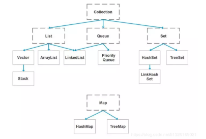

# java

## 一、java基础

### 1. JDK和JRE有什么区别
- JDK: Java Development Kit的简称，java 开发工包，提供了java的开发环境和运行环境。
- JRE: Java Runtime Environment的简称, java 运行环境，为java的运行提供了所需环境。
- 具体来说JDK实包含了JRE,同时还包含了编译java源码的编译器javac,还包含了很多java程序调试和分析的工具。简单来说:如果你需要运行java程序，只需安装JRE就可以了，如果你需要编写java程序,需要安装JDK。

### 2. ==和equals的区别是什么?
> ==解读

对于基本类型和引|用类型==的作用效果是不同的,如
下所示:
- 基本类型:比较的是值是否相同;
- 引用类型:比较的是引|用是否相同;

代码示例:
```java
String x = "string";
String y = "string";
string z = new String("string") ;
System.out.printIn(x==y); // true
System. out.println(x==z) ; // false
System. out.println(x.equa1s(y)); // true
System.out.println(x.equals(z)); // true
```

代码解读：因为x和y指向的是同一个引用，所以也是true,而new String()方法则重写开辟了内
存空间，所以==结果为false,而equals比较的一直是值，所以结果都为true。

> equals 解读

equals 本质上就是==,只不过String和Integer等重写了equals方法，把它变成了值比较。看下面的代码就明白了。

首先来看默认情况下equals 比较-一个有相同值的对象，代码如下:
```java
class Cat
    public Cat(String name) {
        this.name = name ;
    }

    private Str ing name;

    public String getName() {
        return name ;
    }
    public void setName(String name){
        this.name = name ;
    }
}
Cat C1 = new Cat("王磊");
Cat c2 = new Cat("王磊");
Sys tem . out. pr intln(C1. equals(c2)); //false
``` 

输出结果出乎我们的意料，竟然是false?这是怎么回事，看了equals源码就知道了，源码如下:
```java
public boolean equals(Object obj) { 
    return (this == obj);
}
``` 
原来equals本质上就是==。

那问题来了，两个相同值的String对象，为什么返回的是true?代码如下:
```java
String s1 = new String("老王" )
String s2 = new String("老王" )
System.out.println(s1. equals(s2)); //true
```
同样的，当我们进入String的equals方法，找到了答案，代码如下:
```java
public boolean equals(Object anObject) { 
    if (this == an0bject) {
        return true ;
    }
    if (an0bject instanceof String) {
        String anotherString = (String)an0bject;
        int n = value.length ;
        if (n == anotherString.value.length){
            char v1[] = value;
            char v2[] = anotherString;
            int i = 0;
            while(n-- != 0){
                if(v[i] != v2[i])
                    return false;
                i++;
        }
        return true ;
    }
    return false;
}
```
原来是String重写了Object 的equals方法,把引用比较改成了值比较。

> #### <font color=red>总结:</font> 
==对于基本类型来说是值比较,对于引用类型来说是比较的是引用;而equals默认情况下是引用比较，只是很多类重新了equals方法，比如String、 Integer 等把它变成了值比较,所以一般情况下equals比较的是值是否相等。
### 3. 两个对象的hashCode()相同，则equals()也一定为 true,对吗?

不对，两个对象的hashCode()相同，equals()不一定true。

代码示例:
```java
String str1 = "通话";
String str1 = "重地";
System.out.println(String.format("str1：%d | str2：%d", str1.hashCode(),str2.hashCode()));
System. out. pr intln(str1.equals(str2));
```
执行的结果:
```java
1. str1: 1179395| str2: 1179395
2. false
```
代码解读:很显然“通话”和“重地”的hashCode()相同，然而equals()则为false, 因为在散列表中,hashCode()相等即两个键值对的哈希值相等，然而哈希值相等，并不一定能得出键值对相等。

### 4. final在java中有什么作用?
- final 修饰的类叫最终类，该类不能被继承。
- final 修饰的方法不能被重写。
- final 修饰的变量叫常量,常量必须初始化，初始化之后值就不能被修改。

### 5. java中的Math.round(-1.5)等于多少?
等于-1，因为在数轴上取值时，中间值(0.5) 向右取整,所以正0.5是往上取整,负0.5是直接舍弃。

### 6.String属于基础的数据类型吗?
String 不属于基础类型，基础类型有8种: byte、boolean、char、 short、 int、 float、 long、double,而String属于对象。

### 7. java中操作字符串都有哪些类?它们之间有什么区别?
操作字符串的类有: String、 StringBuffer、StringBuilder。

String 和StringBuffer、StringBuilder 的**区别**在于String 声明的是不可变的对象，每次操作都会生成新的String对象，然后将指针指向新的String对象,而StringBuffere、StringBuilder可以在原有对象的基
础上进行操作,所以在经常改变字符串内容的情况下最好不要使用String。

StringBuffer是线程安全的，而StringBuilder是非线程安全的，但StringBuilder的性能却高于StringBuffer, 所以在单线程环境下推荐使用StringBuilder, 多线程环境下推荐使用StringBuffer。

### 8. String str="i"与String str=new String("i")一样吗？
不一样，因为内存的分配方式不-一样。String str="i”的方式，java 虚拟机会将其分配到常量池中;而String str=new String(“i")则会被分到堆内存中。

### 9.如何将字符串反转?
使用StringBuilder或者stringBuffer 的reverse()方法。

示例代码:
```java
// StringBuffer reverse
StringBuffer stringBuffer = new StringBuffer();
stringBuffer.append("abcdefg");
System.out.println(stringBuffer.reverse());//gfedcba
// StringBuilder reverse
StringBuilder stringBuilder = new StringBuilder();
stringBuilder.append("abcdefg");
System.out.println(stringBuilder.reverse());//gfedcba
```

### 10. String类的常用方法都有那些?
1. indexOf(): 返回指定字符的索引
1. charAt(): 返回指定索引处的字符。
1. replace(): 字符串替换。
1. trim(): 去除字符串两端空白。
1. split(): 分割字符串,返回一个分割后的字符串数组。
1. getBytes(): 返回字符串的byte类型数组。
1. length): 返回字符串长度。
1. toLowerCase():将字符串转成小写字母。
1. toUpperCase():将字符串转成大写字符。
1. substring):截取字符串。
1. equals(: 字符串比较。

### 11.抽象类必须要有抽象方法吗?
不需要，抽象类不一定非要有抽象方法。

示例代码:
```java
abstract class Cat {
    public static void sayHi() {
        System.out.print1n("hi~");
    }
}
```
上面代码,抽象类并没有抽象方法但完全可以正常运行。

### 12.普通类和抽象类有哪些区别?
- 普通类不能包含抽象方法,抽象类可以包含抽象方法。
- 抽象类不能直接实例化，普通类可以直接实例化。

### 13.抽象类能使用final修饰吗?
不能，定义抽象类就是让其他类继承的，如果定义为final 该类就不能被继承，这样彼此就会产生矛盾，所以final不能修饰抽象类,编辑器也会提示错误信息:

### 14.接口和抽象类有什么区别?
1. 实现:抽象类的子类使用extends来继承;接口必须使用implements来实现接口。
1. 构造函数:抽象类可以有构造函数;接口不能有构造函数。
1. main方法:抽象类可以有main方法,并且我们能运行它;接口不能有main方法。
1. 实现数量:类可以实现很多个接口;但是只能继承一个抽象类。
1. 访问修饰符:接口中的方法默认使用public修饰;抽象类中的方法可以是任意访问修饰符。

### 15. java中IO流分为几种?
1. 按功能来分:输入流(input)、 输出流(output)
1. 按类型来分:字节流和字符流。

字节流和字符流的区别是:字节流按8位传输以字节为单位输入输出数据，字符流按16位传输以字符为单位输入输出数据。
### 16. BIO、NIO、 AIO 有什么区别?
1. BIO: Block IO同步阻塞式 IO,就是我们平常使用的传统IO,它的特点是模式简单使用方便，并发处理能力低。
1. NIO: New 10同步非阻塞IO，是传统IO的升级,客户端和服务器端通过Channel (通道)通讯，实现了多路复用。
1. AIO: Asynchronous IO是NIO的升级,也叫NIO2，实现了异步非堵塞IO，异步IO的操作基于事件和回调机制。

### 17. Files的常用方法都有哪些?
1. Files. exists():检测文件路径是否存在。
1. Files.createFile(): 创建文件。
1. Files.createDirectory): 创建文件夹。
1. Files.delete(): 删除一 个文件或目录。
1. Files.copy): 复制文件。
1. Files.move(): 移动文件。
1. Files.size(): 查看文件个数。
1. Files.read): 读取文件。
1. Files.write(): 写入文件。

## 二、容器

### 18. java容器都有哪些?
常用容器的图录:


### 19. Collection和Collections有什么区别?
1. java.util.Collection 是一个集合接口 (集合类的一个顶级接口)。它提供了对集合对象进行基本操作的通用接口方法。Collection接口在Java 类库中有很多具体的实现。Collection接口的意义是为各种具体的集合提供了最大化的统一操作方式，其直接继承接口有List与Set。
2. Collections则是集合类的一个工具类/帮助类,其中提供了一系列静态方法，用于对集合中元素进行排序、搜索以及线程安全等各种操作。

### 20. List、Set、 Map之间的区别是什么? 
| 比较         | List       | Set          | Map         |
| -----------  | ----------- | ----------- | ----------- |
| 继承接口      | Collection       |    Collection   |       |
| 常见实现类    | AbstractList（其常用子类有ArrayList、LinkedList、Vetor）        |   AbstractSet（其常用子类有AHashSet、LinkedHashSet、TreeSet）    |       |
| 常见方法      | add()、remove()、clear()、get()、contains()、size()       |    add()、remove()、clear()、contains()、size()    |   put()、get()、remove()、clear()、containsKey()、containsValue()  、keySet()、values()、size()    |
| 元素         | 可重复       |    不可重复(用equals()判断)   |   不可重复    |
| 顺序          | 有序       |    无序(实际上由HashCode决定)   |       |
| 线程安全      | Vetor线程安全       |       |   Hashtable线程安全    |

### 21. HashMap和Hashtable有什么区别?
1. hashMap去掉了HashTable的contains方法,但是加上了containsValue () 和containsKey ()方法。
1. hashTable同步的， 而HashMap是非同步的, 效率上比hashTable要高。
1. hashMap允许空键值，而hashTable不允许。

### 22.如何决定使用HashMap还是TreeMap?
对于在Map中插入、删除和定位元素这类操作,HashMap是最好的选择。然而，假如你需要对一个有序的key集合进行遍历，TreeMap是 更好的选择。基于你的collection的大小，也许向HashMap中添加元素会更快，将map换为TreeMap进行有序key的遍历。
### 23.说一下HashMap的实现原理?
HashMap概述: HashMap是 基于哈希表的Map接口的非同步实现。此实现提供所有可选的映射操作，并允许使用nul值和nul键。此类不保证映射的顺序,特别是它不保证该顺序恒久不变。

HashMap的数据结构:在java编程语言中， 最基本的结构就是两种，一个是数组, 另外-一个是模拟指针(引用)，所有的数据结构都可以用这两个基本结构来构造的，HashMap也不例外。HashMap实际 上是一个“链表散列”的数结构，即数组和链表的结合当我们往Hashmap中put元素时，首先根据key的hashcode重新计算hash值,根绝hash值得到这个元素在数组中的位置(下标)，如果该数组在该位置上已经存放了其他元素那么在这个位置上的元素将以链表的形式存放,新加入的放在链头,最先加入的放入链尾，如果数组中该位置没有元素,就直接将该元素放到数组的该位置上。

需要注意Jdk 1.8中对HashMap的实现做了优化，当链表中的节点数据超过八个之后，该链表会转为红黑树来提高查询效率，从原来的O(n)到0(logn)

### 24.说一下HashSet的实现原理?
1. HashSet底层由HashMap实现
1. HashSet的值存放于HashMap的key上
1. HashMap的value统一为PRESENT

### 25. ArrayList和LinkedList的区别是什么?
最明显的区别是ArrayList底层的数据结构是数组,支持随机访问，而LinkedList 的底层数据结构是双向循环链表，不支持随机访问。使用下标访问一个元素，ArrayList 的时间复杂度是O(1)，而LinkedList是O(n)。

### 26.如何实现数组和List 之间的转换?
1. List转换成为数组:调用ArrayList的toArray方法。
1. 数组转换成为List: 调用Arrays的asList方法。

### 27. ArrayList和Vector的区别是什么?
1. Vector是同步的，而ArrayList不是。 然而，如果你寻求在迭代的时候对列表进行改变,你应该使用CopyOnWriteArrayList。
1. ArrayList比Vector快， 它因为有同步，不会过载
1. ArrayList更加通用，因为我们可以使用Collections工具类轻易地获取同步列表和只读列表。

### 28. Array和ArrayList有何区别?
1. Array可以容纳基本类型和对象，而ArrayList只能容纳对象。
1. Array是指定大小的，而ArrayList大小是固定的。
1. Array没有提供ArrayList那么多功能，比如addAll、removeAll和iterator等 。

### 29.在Queue中pol()和remove()有什么区
poll() 和remove()都是从队列中取出一个元素，但是poll()在获取元素失败的时候会返回空,但是remove()失败的时候会抛出异常。

### 30.哪些集合类是线程安全的?
1. vector: 就比arraylist多了个同步化机制(线程安全)，因为效率较低,现在已经不太建议使用。在web应用中，特别是前台页面，往往效率(页面响应速度)是优先考虑的。
1. statck: 堆栈类,先进后出。
1. hashtable: 就比hashmap多了个线程安全。
1. enumeration:枚举，相当于迭代器。

### 31.迭代器Iterator是什么?
迭代器是一种设计模式，它是一个对象， 它可以遍历并选择序列中的对象，而开发人员不需要了解该序列的底层结构。迭代器通常被称为“轻量级”对象,因创建它的代价小。

### 32. Iterator 怎么使用?有什么特点?
Java中的Iterator功能比较简单,并且只能单向移动。

1. 使用方法iterator()要求容器返回一-个Iterator。第一次调用Iterator的next()方法时，它返回序列的第一个元素。 注意: iterator()方法是java.lang.lterable接口，被Collection继承。
1. 使用next()获得序列中的下一个元素。
1. 使用hasNext)检查序列中是否还有元素。
1. 使用remove()将迭代器新返回的元素删除。

Iterator是Java迭代器最简单的实现，为List设计的Listlterator具有更多的功能，它可以从两个方向遍历List,也可以从List中插入和删除元素。

### 33. lterator 和Listlterator 有什么区别?
1. Iterator可用来遍历Set和List集合, 但是Listlterator只能用来遍历List。
1. Iterator对集合只能是前向遍历，Listlterator既可以前向也可以后向。
1. Listlterator实现了lterator接口， 并包含其他的功能，比如:增加元素，替换元素，获取前一个和后一个元素的索引，等等。


## 三、多线程

## 四、反射

## 五、对象拷贝

## 六、java Web

## 七、异常

## 八、网络

## 九、设计模式

## 十、spring/springmvc

## 十一、springBoot/SpringCloud

## 十二、Hibernate

## 十三、Mybais

## 十四、RabbitMQ

## 十五、Kafka

## 十六、Zookeeper

## 十七、Mysql

## 十八、Redis

## 十九、JVM


### 1. 使用javac命令来编译.java文件
#### 打算复读
> javac Test.java

### 2. 使用java命令来运行

> javac Test

# java基础

